# 随手记账 · 用户使用指南

> 一款**本地优先**的轻量记账应用：打开即记，数据存在你自己的设备里；
> 登录后可在多台设备之间同步。本文用截图带你过一遍每个界面的功能。

- 适用版本：v0.5+
- 运行环境：手机或电脑浏览器（建议手机添加到主屏幕使用，体验接近原生 App）

---

## 目录

1. [首页 —— 一眼看懂这个月](#1-首页)
2. [记一笔 —— 三秒记账](#2-记一笔)
3. [账单页 —— 流水与日历](#3-账单页)
4. [按月 / 按年查看](#4-按月--按年查看)
5. [统计页 —— 钱花哪儿了](#5-统计页)
6. [分类管理](#6-分类管理)
7. [我的 —— 账号与登录](#7-我的--账号与登录)
8. [数据备份与恢复](#8-数据备份与恢复)
9. [数据存在哪、怎么同步](#9-数据存在哪怎么同步)
10. [常见问题](#10-常见问题)

---

## 1. 首页

打开 App 就是首页，回答的是「这个月过得怎么样」：

- **本月支出 / 收入 / 结余 / 日均支出**：当前月份的四个核心数字，右上角胶囊显示统计区间。
- **今日账单**：今天记的每一笔（图标 + 分类 + 备注 + 金额），收入绿色、支出黑色带 `-`。
- **更多明细**：跳转账单页查看全部。
- **编辑分类**：快速进入分类管理。
- 底部中间的 **＋ 按钮**：随时开始记一笔。

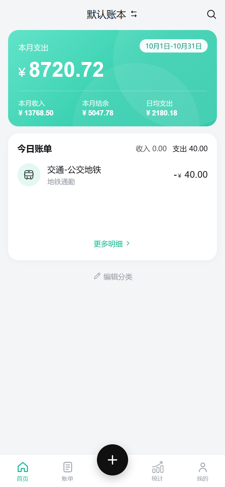

## 2. 记一笔

点底部 **＋** 进入记账页：

- **支出 / 收入**：顶部切换，分类宫格会跟着切换。
- **分类宫格**：点一个分类（如「餐饮」）即选中；长按/宫格最后一格可进入分类管理。
- **备注**：底部输入框，可不填。
- **日期与账本**：金额上方的两个胶囊，点「今天」可以改记账日期，点「默认账本」切换账本。
- **数字键盘**：输入金额，`+` / `-` 可以一笔里混合多段金额（如 12+8）。
  - **再记**：保存当前这笔并立刻开始下一笔，适合连续记好几笔；
  - **完成**：保存并返回。

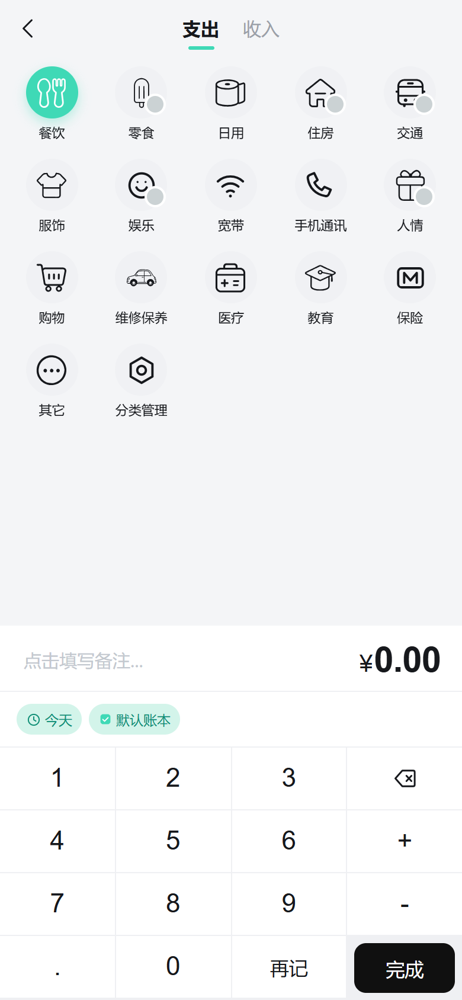

## 3. 账单页

底部第二个 Tab，查看所有历史账单，有**流水**和**日历**两种视图：

**流水视图**（默认）：按日期倒序分组，每天一行小计（收 ¥x / 支 ¥x）；顶部卡片是当月
结余、支出、收入、预算和剩余。点任意一笔可以进入详情修改或删除。

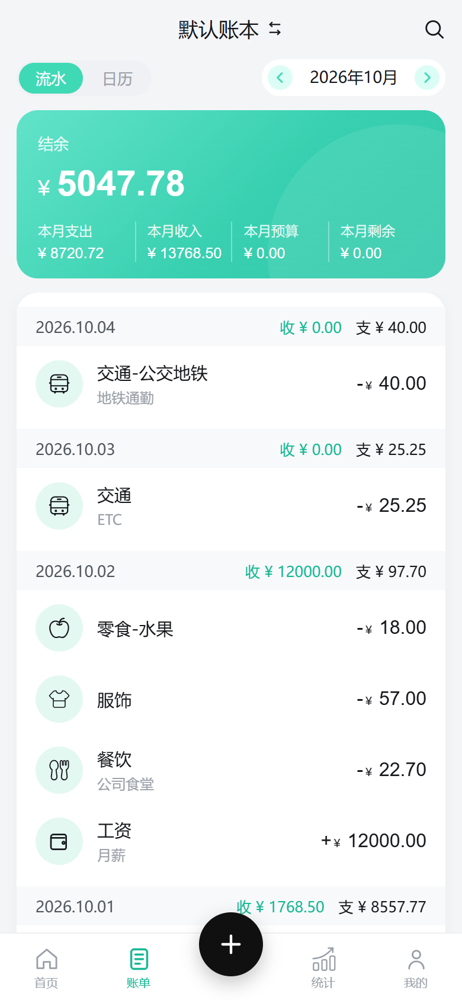

**日历视图**：按月历展示，每天格子下方标当日支出合计（今天的日期高亮）；底部是当月支出总额。
适合核对「哪天花了大钱」。

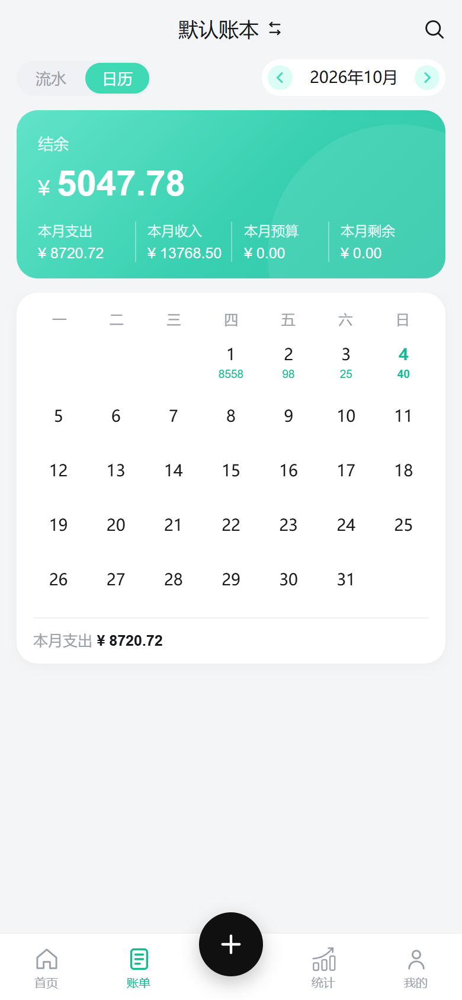

## 4. 按月 / 按年查看

点账单页或统计页顶部的 **「2026年10月」**，会弹出时间选择器：

- **按月查看**：一年 12 个月的网格，左右箭头翻年份，点某个月直接跳转。
- **按年查看**：切到「按年」页签，直接选年份，整年汇总。

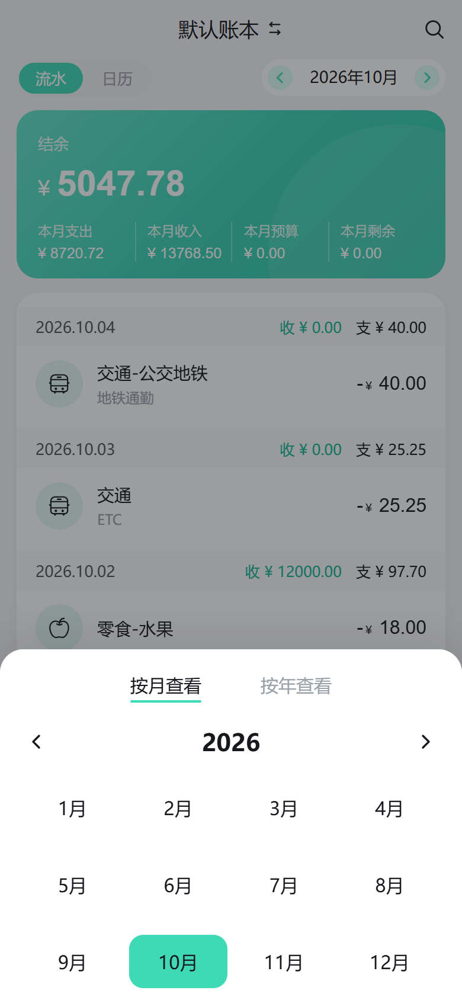

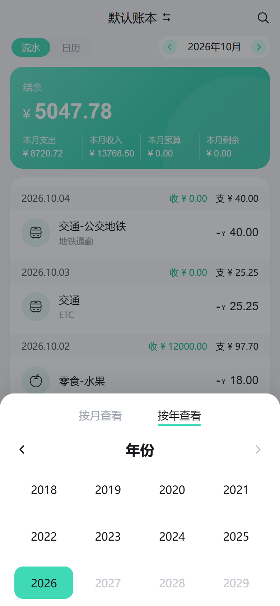

## 5. 统计页

底部第三个 Tab，回答「钱花哪儿了」：

- **本月概览**：支出 / 收入 / 结余。
- **支出 / 收入**：切换统计方向。
- **趋势图**：按天（或按月）的折线，点某天看当日明细。
- **分类排行**：按一级分类从高到低排列，条形长度即占比，显示笔数与百分比；
  「查看更多」展开完整列表。

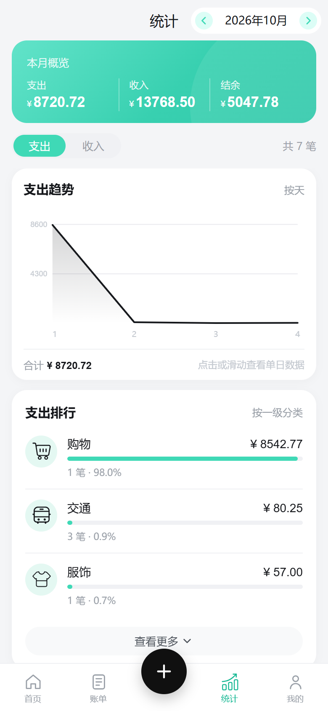

## 6. 分类管理

入口：「我的 → 分类管理」，或记账页宫格最后一格。

- **一级分类**：宫格展示，右上角可切换支出 / 收入两套分类；底部「新建一级分类」。
- 点任意分类弹出操作条：**编辑**（改名 / 换图标）、**删除**、进入**二级分类管理**
  （如「餐饮」下可建「早餐 / 午餐 / 晚餐」，记账时选中一级后可再选二级）。
- 有账单引用的分类删除时会受保护，不必担心误删导致账单失效。

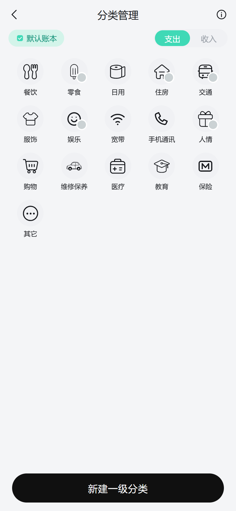

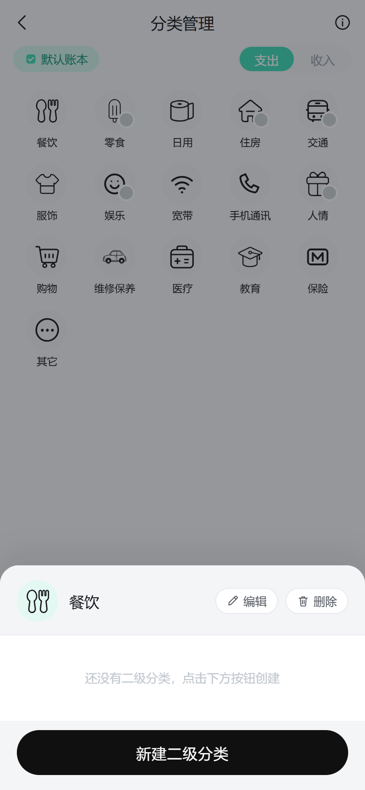

## 7. 我的 —— 账号与登录

底部最后一个 Tab，集中了账号、数据与同步相关功能：

- **登录 / 注册**：手机号 + 短信验证码登录。**登录后才能记账**，账目会在你的多台设备之间
  自动同步。
- 未登录时可以浏览统计和账单页，但点「＋」或任何写操作都会先弹登录框——
  这是刻意设计：未登录的数据存在临时分区，登录后看不到，拦在门口比记完再丢更诚实。
- **数据层状态**：展开可查看本地数据库状态与手动同步。
- **关于**：版本信息。

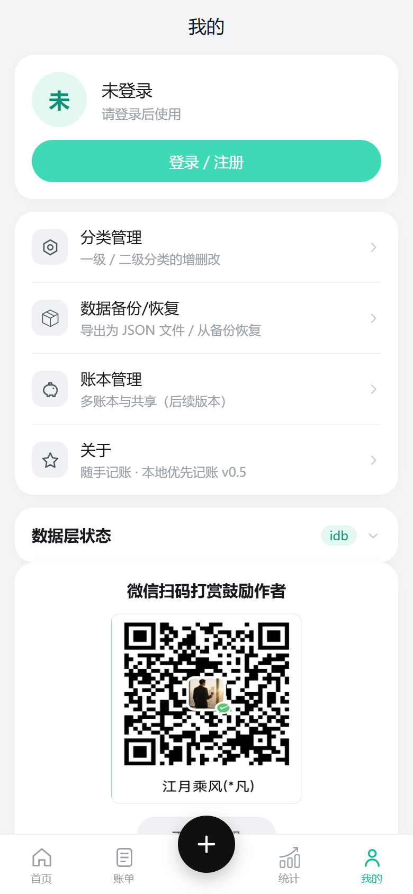

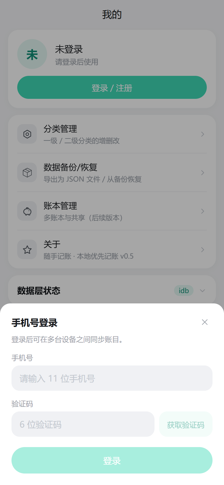

## 8. 数据备份与恢复

入口：「我的 → 数据备份/恢复」。备份文件是纯 JSON，**不经过任何服务器**。

- **导出备份**：一键生成 JSON 文件保存到本机（或发给自己 / 存网盘）。
  文件里包含账单与分类，不含账号密码。
- **从备份恢复**：选择之前导出的文件，App 会先**预览将恢复哪些内容**，确认后再导入；
  同一笔账两边都有时以较新的一方为准，不会产生重复。

> 建议：养成每月导出一次的习惯；换手机、清浏览器数据、重装系统之前，先导出一份。

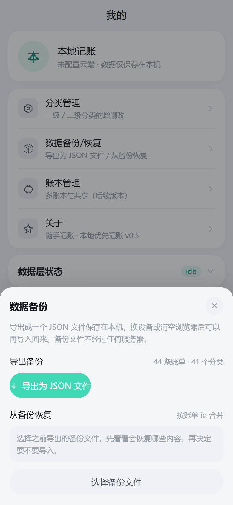

## 9. 数据存在哪、怎么同步

- **本地优先**：每一笔账先写入本机（浏览器 IndexedDB），断网也能正常记账；
  联网后自动把待同步的改动推到云端，再拉回其它设备的改动。
- **多端同步**：同一手机号登录的所有设备自动保持一致；A 设备记一笔，B 设备几秒内可见。
- **退出登录**：会先把待同步的改动推干净，再清空本机数据——不会丢账，
  重新登录后全部回来。
- **未配置云端时**：App 完全可以当纯本地记账本用（界面会标注「数据仅保存在本机」），
  此时请务必自己定期导出备份。

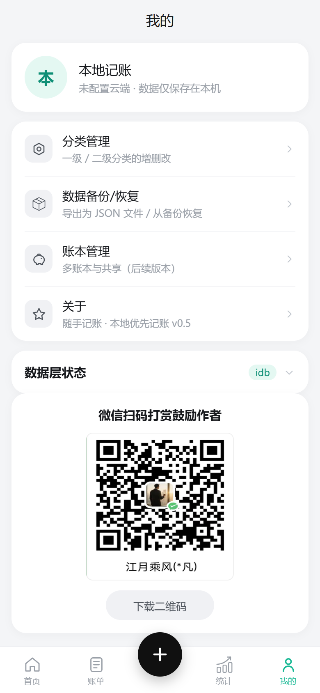

## 10. 常见问题

**Q：一定要登录吗？**
浏览不需要；记账需要。未登录点「＋」会引导你先用手机号登录。

**Q：换手机 / 换浏览器，数据还在吗？**
登录同一账号即可，云端数据会完整拉回。没登录过的数据不会迁移，记得先导出备份。

**Q：记错了怎么改？**
账单页点那笔账进入详情，可修改或删除；删除是软删除，其它设备同步后也会一起消失。

**Q：断网了能记账吗？**
能。断网期间照常记账，恢复网络后自动补同步。

**Q：支持多账本吗？**
界面已预留「账本管理」，多账本与共享在后续版本提供。

---

*本指南截图基于 v0.5 开发版界面，随版本迭代可能略有差异。*
