# 随手记账 · 软件设计文档（SDD）

> 版本：v1.0（对应代码 v0.5.0，S8 阶段收尾）  
> 适用读者：接手本项目的工程师、需要理解数据层的协作者、做云端/后端替换的人  
> 阅读顺序建议：第 1 章 → 第 3 章（时序图）→ 第 4 章（模块接口）→ 第 7 章（数据设计）。  
> 第 2、5、6 章供查阅，第 8~11 章是纪律与扩展指引。

---

## 0. 本文档的定位与约定

### 0.1 与其它文档的分工

| 文档                       | 回答的问题                            | 性质        |
| ------------------------ | -------------------------------- | --------- |
| `README.md`              | 怎么跑起来、怎么打包部署、怎么配云端               | 操作手册      |
| `page-structure.md`      | 每个页面长什么样、有哪些区块与交互                | UI 规格     |
| `phase2-backend-plan.md` | **为什么**这么做（S0~S8 的决策与踩坑记录，16 万字） | 决策日志 / 复盘 |
| **`软件设计文档.md`（本文）**      | **系统现在是什么结构**：分层、时序、接口、数据结构      | 结构说明书     |

三者的边界：`phase2-backend-plan.md` 是**历史**（决策过程），本文是**现状**（设计结果）。  
接手时先读本文建立结构认知，需要追问「为什么不用另一种做法」时再回查计划书。

### 0.2 图例约定

本文所有图用 **Mermaid** 绘制（GitHub / VS Code / 多数 Markdown 阅读器可直接渲染）：

| 图类型  | Mermaid 关键字       | 本文用途                    |
| ---- | ----------------- | ----------------------- |
| 时序图  | `sequenceDiagram` | 启动、写一笔账、一轮同步、登录切换、导出导入  |
| 类图   | `classDiagram`    | 适配器契约、云客户端契约、Store↔Repo |
| 状态机  | `stateDiagram-v2` | 同步引擎四态、账号两态             |
| 流程图  | `flowchart`       | 分层架构、初始化决策、合并裁决         |
| ER 图 | `erDiagram`       | IndexedDB / 云端集合的字段关系   |

### 0.3 命名与术语速查

| 术语                 | 含义                                      | 别名/易混项                     |
| ------------------ | --------------------------------------- | -------------------------- |
| **分区（partition）**  | 一个账号在**本机**对应的一个 IndexedDB 库            | 库名 `ledger_<账号前缀8位>`       |
| **guest 分区**       | 未登录状态用的库 `ledger_guest`                 | 旧名 `ledger_anon`（已废弃，不再读取） |
| **裸库**             | S5 之前所有数据的老家，库名就是 `ledger`              | 不再被任何分区继承（S7-10）           |
| **集合（collection）** | 业务上的一类文档：`ledger` / `category` / `bill` | 云端对应 `ledger_*` 表          |
| **outbox**         | 本地待推送队列（IndexedDB 的 `outbox` 表）         | 「信箱」，同步引擎是「邮递员」            |
| **水位线（watermark）** | 增量拉取进度，存的是一条 `_serverTs`                | `syncWatermark`            |
| **裁决刻度**           | 服务端盖的「这份内容是哪一刻被接收的」                     | 业务字段 `serverUpdatedAt`     |
| **`_serverTs`**    | 服务端**接收该次写入**的时间，只服务水位线                 | 与裁决刻度**不是一回事**             |
| **别名（alias）**      | 云端 `_id` = `<账号前缀>_<本地id>`              | 不是本地 id                    |
| **本地 id**          | 文档业务主键，写在字段 `id` 里                      | 设备无关，跨设备同一笔账               |

---

## 1. 系统概览

### 1.1 产品与范围

「随手记账」是一个**移动端 Web（H5）记账 App**：

- **形态**：纯前端 SPA，哈希路由，无自建服务端；产物是静态文件，直接托管。
- **数据**：**本地优先（local-first）**。IndexedDB 是权威副本，云端是「跨设备同步的第二副本」。
- **后端**：腾讯云开发 CloudBase（文档型 NoSQL + 静态托管 + 手机验证码认证 + 2 个云函数）。
- **账号**：**手机号验证码登录**。**没有匿名身份**（S7 移除）—— 未登录只能浏览，写操作弹登录。
- **核心功能**：记一笔 / 改 / 删；首页总览；账单流水 + 日历；统计（趋势 + 排行）；分类管理；数据备份导出/导入；账号与同步状态。

**明确不做的事**（避免后人误加）：

- 不做多账本切换（`ledgers` 集合与 `ledgerId` 字段已预留，UI 固定用 `ledger_default`）。
- 不做转账 / 借贷账单类型（枚举保留取值仅为兼容历史文档，UI 只产出 `expense` / `income`）。
- 不做服务端渲染、不做自建 API 网关（云函数仅 2 个，且只做「读时间」和「盖刻度」）。

### 1.2 技术栈

| 层      | 选型                              | 版本      | 说明                                           |
| ------ | ------------------------------- | ------- | -------------------------------------------- |
| 视图     | Vue 3（`<script setup>` SFC）     | ^3.5.13 | 组合式 API                                      |
| 状态     | Pinia                           | ^2.2.6  | 4 个 store：ledger / category / bill / account |
| 路由     | Vue Router（web hash）            | ^4.4.5  | 哈希路由，静态托管无需服务端重写规则                           |
| 构建     | Vite                            | ^6.0.7  | 产物 `dist/`                                   |
| 本地库    | 原生 IndexedDB（**无封装库**）          | —       | 自研 `core/idb.js` 提供原语                        |
| 云端 SDK | `@cloudbase/js-sdk`             | ^3.10.1 | 动态 import，独立 chunk                           |
| 测试     | 自研 Node 断言脚本 + `fake-indexeddb` | ^6.2.5  | `npm run test:data`，813 条断言                  |
| 云端函数   | `wx-server-sdk`                 | —       | Node 运行时，2 个函数                               |

> **为什么不用 Dexie/idb 之类的 IndexedDB 封装**：本项目需要的是「探活 + 自动重连」+「读-改-写分事务」两条定制行为（Chrome 会单方面关闭空闲连接），  
> 自己写 200 行原语比适配封装库的抽象更省事。见 `core/idb.js` 的 `createIdbConnection`。

### 1.3 分层架构

```
┌──────────────────────────────────────────────────────────────────────────────┐
│  展示层  views/ (8 个页面)  +  components/ (19 个组件)                        │
│  职责：渲染、交互、表单校验、路由守卫。**不直连 adapter，不写业务规则**        │
└───────────────────────────────┬──────────────────────────────────────────────┘
                                │ 只依赖 store 的 state / getters / actions
┌───────────────────────────────▼──────────────────────────────────────────────┐
│  状态层  stores/  (Pinia)                                                    │
│  ledger / category / bill / account                                          │
│  职责：页面级缓存、派生视图数据（排行/趋势/日历）、把写操作转发给 repository  │
│  无业务规则：合并、过滤、排序、汇总全部来自 core/                            │
└───────────────────────────────┬──────────────────────────────────────────────┘
                                │ 只 import { ledgerRepo, categoryRepo, billRepo, db, syncEngine }
┌───────────────────────────────▼──────────────────────────────────────────────┐
│  装配层  api/index.js                                                        │
│  职责：**稳定代理** —— 对外的 repo/engine 对象永不更换，内部指针随账号切换     │
│  同时是唯一的云端装配点（cloud 单例）与备份编排点（export/preview/apply）      │
└──────────────┬──────────────────────────────────────────┬────────────────────┘
               │                                          │
┌──────────────▼───────────────┐          ┌───────────────▼────────────────────┐
│  适配层  adapters/           │          │  同步层  sync/                     │
│  mockAdapter（内存/测试基座） │          │  syncEngine（四态调度骨架）         │
│  idbAdapter（本地权威存储）   │          │  outbox（队列语义）                 │
│  cloudbaseAdapter（云端副本） │          │  outboxStore（队列存储后端）        │
│                              │          │  cloudClient（云接口契约）          │
│                              │          │  errors（错误分类与策略）           │
│                              │          │  fakeCloud（测试用假云端）          │
└──────────────┬───────────────┘          └───────────────┬────────────────────┘
               │  共用（**规则只写一份**）                  │
┌──────────────▼──────────────────────────────────────────▼────────────────────┐
│  核心规则层  api/core/      纯函数 / 无 IO                                    │
│  query.js   过滤·排序·聚合·派生字段                                          │
│  merge.js   冲突裁决（LWW + 服务端刻度）                                     │
│  migrate.js 演示数据增量迁移（只补不覆盖·幂等）                               │
│  cloudId.js 本地 id ↔ 云端别名映射                                           │
│  backup.js  导出打包 / 导入合并 / 恢复计划                                   │
│  idb.js     IndexedDB 原语 + 连接自愈 + 库分区搬迁                            │
└──────────────────────────────────────────────────────────────────────────────┘
        ▲                                                    ▲
        │ 种子定义                                            │ 配置
   api/mock/seed.js                                    config/env.js · config/cloud.js
```

**依赖方向严格单向**：`views → stores → api（装配）→ adapters/sync → core`。  
`core/` 不 import 任何适配器，也不碰 `localStorage` / `indexedDB` / DOM。

### 1.4 目录与职责一览

| 路径                    | 文件数 | 职责                                         | 关键约束                                   |
| --------------------- | --- | ------------------------------------------ | -------------------------------------- |
| `src/api/core/`       | 6   | 业务规则的**唯一实现处**（纯函数）                        | 禁止 IO、禁止 import 适配器                    |
| `src/api/adapters/`   | 3   | 存储实现，实现同一套契约                               | 只做取数/写回，规则调 `core/`                    |
| `src/api/sync/`       | 6   | 同步调度、队列、云接口、错误分类                           | 队列与业务数据同库                              |
| `src/api/mock/`       | 1   | 种子数据定义（分类树、演示账单）                           | 演示账单**只在 DEV 构建存在**                    |
| `src/api/index.js`    | 1   | 装配 + 稳定代理 + 备份编排                           | 唯一装配点                                  |
| `src/api/contract.js` | 1   | 契约文档 + 枚举 + 错误类                            | 无实现                                    |
| `src/stores/`         | 4   | 页面级状态缓存与派生                                 | 不直调 adapter                            |
| `src/composables/`    | 5   | 可复用交互逻辑（滑动/门禁/草稿/弹层/toast）                 | 门禁是 UI 引导，**不是安全边界**                   |
| `src/utils/`          | 3   | 日期、金额、id 工具                                | 纯函数                                    |
| `src/config/`         | 2   | 环境变量与云端资源命名                                | 前端只认 `VITE_` 前缀                        |
| `src/views/`          | 8   | 页面                                         | 走 store，不直连 repo（`MineView` 例外，只读调试入口） |
| `src/components/`     | 19  | 通用组件 + `icons/` 图标库（15 个模块）                | 图标路径**自动生成，禁手改**                       |
| `cloudfunctions/`     | 2   | `ledger-server-time` / `ledger-sync-stamp` | 目录名必须等于函数名                             |
| `scripts/`            | 15  | 10 个测试 + 图标转换/预览/审计工具                      | 断言统一走 `_harness.mjs`                   |

### 1.5 五条贯穿全局的设计原则

| #      | 原则                | 落地方式                                                                    | 违反后果            |
| ------ | ----------------- | ----------------------------------------------------------------------- | --------------- |
| **P1** | **本地优先**          | 写操作先落 IndexedDB，再入 outbox；云端只是第二副本                                      | 断网不能记账          |
| **P2** | **业务规则只写一份**      | 过滤/排序/聚合/裁决/迁移全在 `core/`，适配器共用                                          | 两个适配器行为漂移，契约测试红 |
| **P3** | **后端可替换**         | 视图形状固定；云接口只有 3 个方法（pull/push/serverTime）                                | 换厂商要改全项目        |
| **P4** | **规则收口在唯一一处**     | 例：`updatedAt` 是否失效只在 `effectiveServerStamp` 判；门禁只在 `shouldAllowWrite` 判 | 漏一处就静默错判        |
| **P5** | **宁可留冗余，不冒丢数据风险** | 接管 localStorage / 搬家不删源；退出登录前先推干净                                       | 用户账目丢失          |

---

## 2. 运行时视图总览

系统有 **7 条关键运行时路径**，全部在下面按序展开（另加 3.4 一节讲贯穿其中的裁决规则）：

| #  | 路径                          | 触发点                          | 图       |
| -- | --------------------------- | ---------------------------- | ------- |
| R1 | 应用启动                        | 打开页面                         | 3.1 时序图 |
| R2 | 记一笔账（写路径）                   | 点「保存」                        | 3.2 时序图 |
| R3 | 一轮同步                        | 启动 / 写后防抖 / online / 手动 / 退避 | 3.3 时序图 |
| —  | **冲突裁决（贯穿 pull 与 push 两侧）** | 每次拿到远端文档时                    | 3.4 流程图 |
| R4 | 登录（含账号切换）                   | 登录成功                         | 3.5 时序图 |
| R5 | 退出登录                        | 点「退出登录」                      | 3.6 时序图 |
| R6 | 注销账号                        | 双确认后                         | 3.7 时序图 |
| R7 | 备份导出 / 导入                   | 「我的 → 数据备份」                  | 3.8 时序图 |

---

## 3. 关键时序与裁决流程

### 3.1 R1 · 应用启动

**核心矛盾**：`repository` 是「指向当前分区的代理」，分区由**当前身份**决定，而身份必须**异步**问云端。  
但 ESM 的 `import` 是静态的 —— store 里 `import { billRepo }` 拿到的绑定在模块求值时就存在了。  
解法：代理对象永不更换，内部指针 `current` 在 `initDataLayer()` 里被指向正确实例。

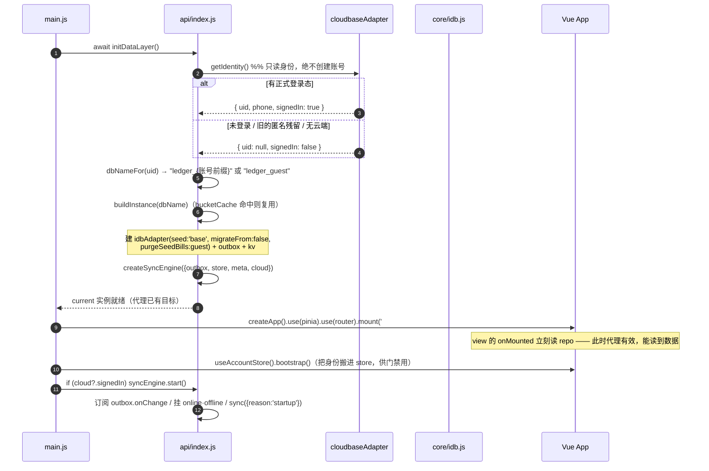

**为什么顺序不能变**（每一步都有一次真实事故）：

1. **先 init 再 mount**：反过来的话，view 的 `onMounted` 读到的 `current` 还是 `null`，  
   `billRepo.list` 抛 `is not a function`；而 store 的 `initialized` 已被置真，**之后永不重试**，  
   首页停在 0.00。
2. **mount 后立刻 bootstrap**：账号卡片、登录门禁都读 `account.signedIn`。  
   等「我的」页自己 bootstrap 的话，**从其它页面进入时它还是默认的「未登录」** ——  
   实测「首页点 +，明明登录着却被门禁拦住」。
3. **最后一秒才 start 同步**：同步是后台行为，不该挡首屏；且**只在已登录时启动**，  
   未登录没什么可同步的，引擎开着只会让 UI 一直显示「同步失败」。

### 3.2 R2 · 记一笔账（写路径）

**写路径的铁律：先落数据、再入队。** 用户点保存 → 数据已经在本地库里了 → 才去投递队列。  
队列写失败会被 `enqueue()` 内部 try/catch 吞掉（只打日志）——**绝不能因为队列写不进去而让用户的账白记**。

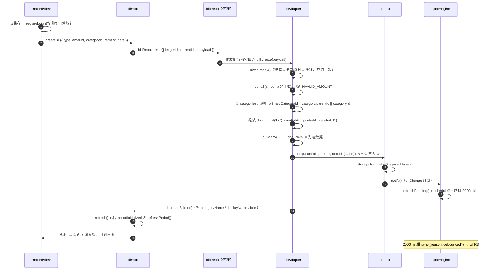


**关键细节：**

- **`primaryCategoryId` 是冗余字段**：账单存了二级分类 id 时，同时存一份一级分类 id。  
  理由：统计页按一级分类聚合（`rankOf`）与列表展示一级图标时，不必反查分类表、也不怕分类被删后悬空。  
  计算规则只在 `idbAdapter.bill.create/update` 里写一次。
- **`decorateBill` 的派生字段不落库**：`categoryName` / `categoryIcon` / `displayName` 是**读时派生**的  
  （`core/query.js`），库里只存 id。这样分类改名后历史账单立即跟着变，无需批量回写。
- **校验放在适配器而不是 store**：`INVALID_AMOUNT` / `NOT_FOUND` 等 `RepositoryError` 由适配器抛，  
  两个适配器行为天然一致（`contract-test` 对照断言）。

### 3.3 R3 · 一轮同步（pull → push → 回拉被拒 → compact）

**顺序是硬约束：先拉后推。** 反过来（先推）会用本地旧版本盖掉云端较新版本，另一台设备的修改被无声抹掉。

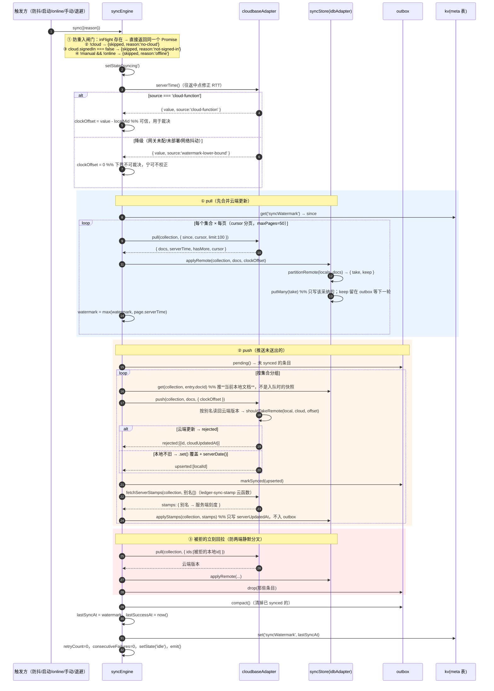

**四个容易看漏的设计点：**

| 点                            | 说明                                                                                      |
| ---------------------------- | --------------------------------------------------------------------------------------- |
| **水位线只认云端快照时间**              | `page.serverTime` 是云端在**查询开始前**决定的，所以查询期间产生的新写入必然大于它 → 留给下一轮，不会漏。（不是取 `max(updatedAt)`） |
| **`_serverTs >= since` 是左闭** | 会重复拉到恰好等于水位的那一两条。这是**刻意的**：宁可多拉一次也不能漏；重复拉取由 LWW 幂等吸收。                                   |
| **推的是当前本地文档**                | 不是入队时的 payload 快照。否则一条已被云端否决的旧快照会被原样推上去，把云端的正确版本改回去。                                    |
| **`applyStamps` 不走写路径**      | 服务端刻度不是用户内容：不入 outbox（否则自己推自己）、不动 `updatedAt`（内容版本是客户端时钟打的）。                            |

### 3.4 冲突裁决（LWW + 服务端刻度）

裁决规则只有一份实现：`core/merge.js` 的 `shouldTakeRemote(localDoc, remoteDoc, clockOffset)`。  
**push 方向也调它**（`shouldTakeRemote(doc, cloud, offset)`）——两个方向必须同一套规则，  
否则推送说「我更新」、拉取说「你更旧」，两端来回打架。

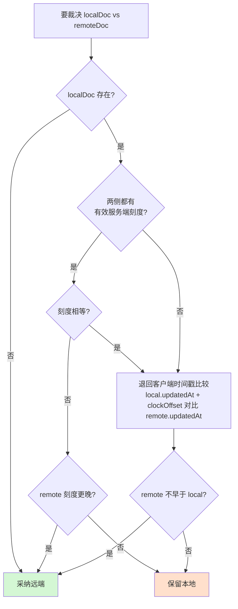

**「有效刻度」的判据**（`effectiveServerStamp`）：刻度值 > 0 **且** `doc.updatedAt <= 刻度`。  
后者是必需的 —— 本地被再次修改后，旧刻度标的是**上一版**，拿来比会让「刚改完的新内容被云端旧内容覆盖」：

```
① 拉到 v1，附带刻度 T1（内容 v1 在 T1 被接收）
② 本地改成 v2（只更新 updatedAt，刻度字段还是 T1）
③ 刻度相等 → 若直接判「云端赢」⇒ 本地刚改的 v2 被 v1 盖掉，用户白改了
```

**刻度相等时不能直接判云端赢** —— 落到 `updatedAt` 比较，让「慢时钟设备刚改的那版」有机会赢。  
`clockOffset` 只在本机时钟偏差**可信**（`source === 'cloud-function'`）时才非 0，  
且**只加在本地那一侧**（刻度那一侧本来就在服务端时间轴上，再加一次偏移会把刚修好的分叉重新引入）。

### 3.5 R4 · 登录与账号切换

**「顺序错了会静默串号」是这一节的全部理由**，所以三步（登录 / 切分区 / 重绑+同步）被收敛进  
`account.runIdentityChange()` 一处。

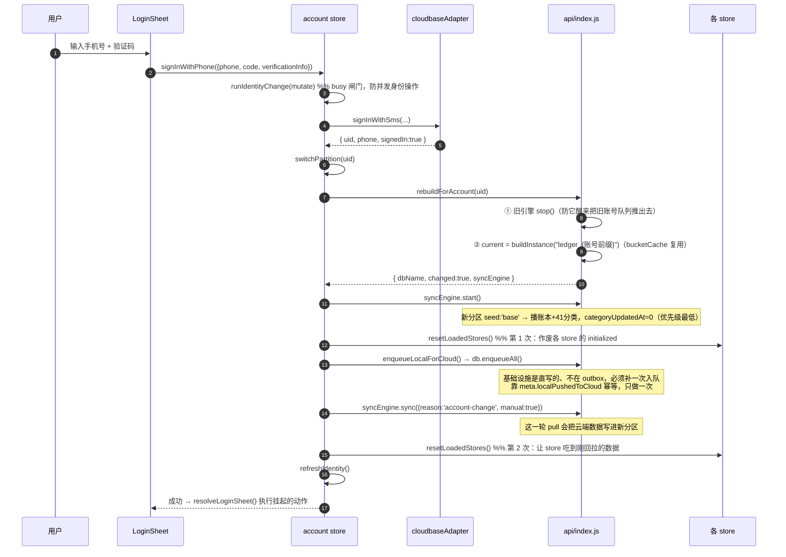

**为什么必须刷两次 store**：第 1 次在 sync **之前**，读到的是「登录瞬间的空库」，且把各 store 的  
`initialized` 置真 —— 之后页面再怎么切都不会重读。真机实测症状是「重登后分类宫格空白」。  
所以 sync 之后必须再刷一次（`account.js` 里那段注释就是这次事故的记录）。

**为什么「换号必须先退出」**：当前 UI 是「先退出再登录」，这是**有意的**。退出会把本地清空 + 清水位线，  
于是登录时的分区必然是空库、必然全量回拉。若改成「直接登录换号」，新账号的分区里可能留着  
上一个账号的数据（分区按账号隔离，但同一个 uid 重新登录时会命中同一个库）。

### 3.6 R5 · 退出登录

**规则：先把改动全部推上云，再清掉本地这份副本。** 推不干净就**取消退出**并告诉用户原因 —— 宁可退不出去，不可丢账。

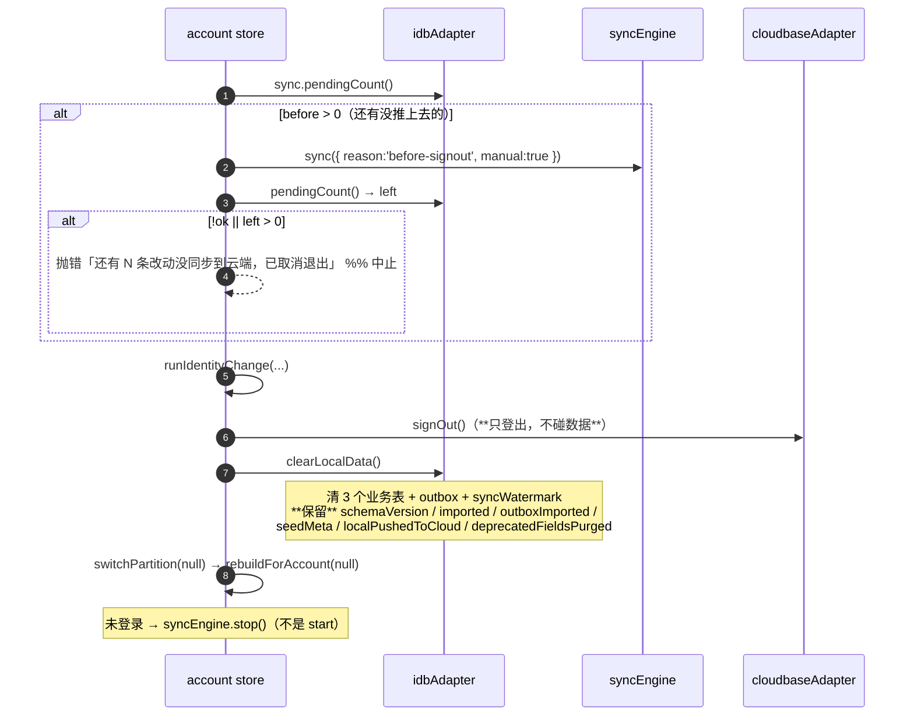

**`clearLocalData` 必须清水位线**：留着的话下次登录是增量拉取，而云端文档的 `_serverTs` 都早于水位，  
一条都拉不回来 —— 用户会看到一个**空账号**（数据其实还在云端）。

### 3.7 R6 · 注销账号

**顺序错一步就清不干净，且都是静默出错。**

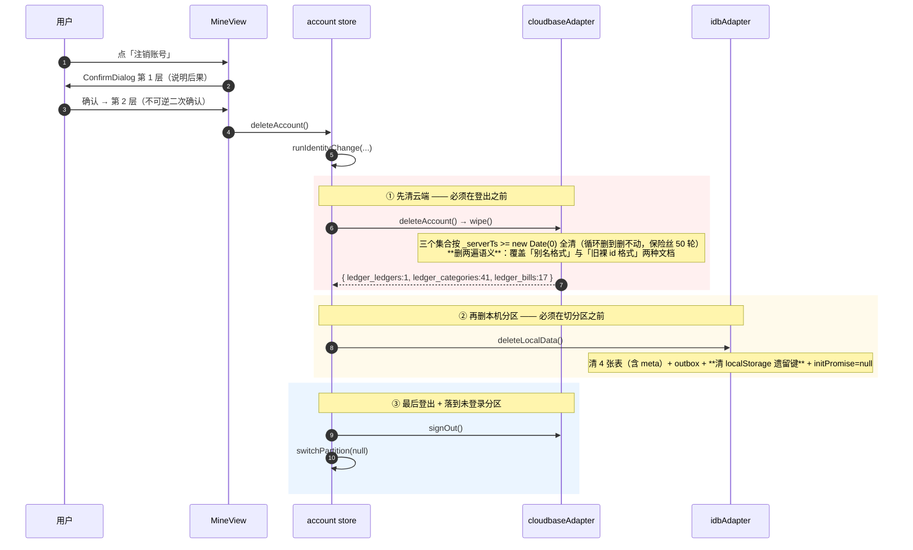

**为什么是「清空 + 抹标记」而不是 `indexedDB.deleteDatabase()`**：实测（与规范一致）还有别的连接  
（另一个标签页）开着时，`deleteDatabase()` 不失败而是进入 `blocked` **被永久挂起**，  
此后连 `open()` 同一个库都会排到那个挂起的删除请求**后面** —— 「删不掉就退回去清表」这条兜底会自己锁死。  
「清四张表 + 抹 meta + 清遗留键 + `initPromise=null`」在行为上与删库**完全等价**，且不留挂起请求。

**平台侧账号记录会保留**：`auth.deleteUser({password})` 强制要密码，而短信登录的账号从来没有密码。  
所以「注销」在本产品里的落地是「云端数据清空 + 本机数据清空 + 登出」。  
用户再拿同一个手机号登录会得到**全新的空账本** —— 对用户而言数据确实不可恢复。  
⚠️ 注销文案**不得**出现「账号记录」四字（`gate-test` 第 5j 节反向断言，注释也算）。

### 3.8 R7 · 备份导出 / 导入

**导出是读操作、不设登录门禁；导入必须过门禁。**

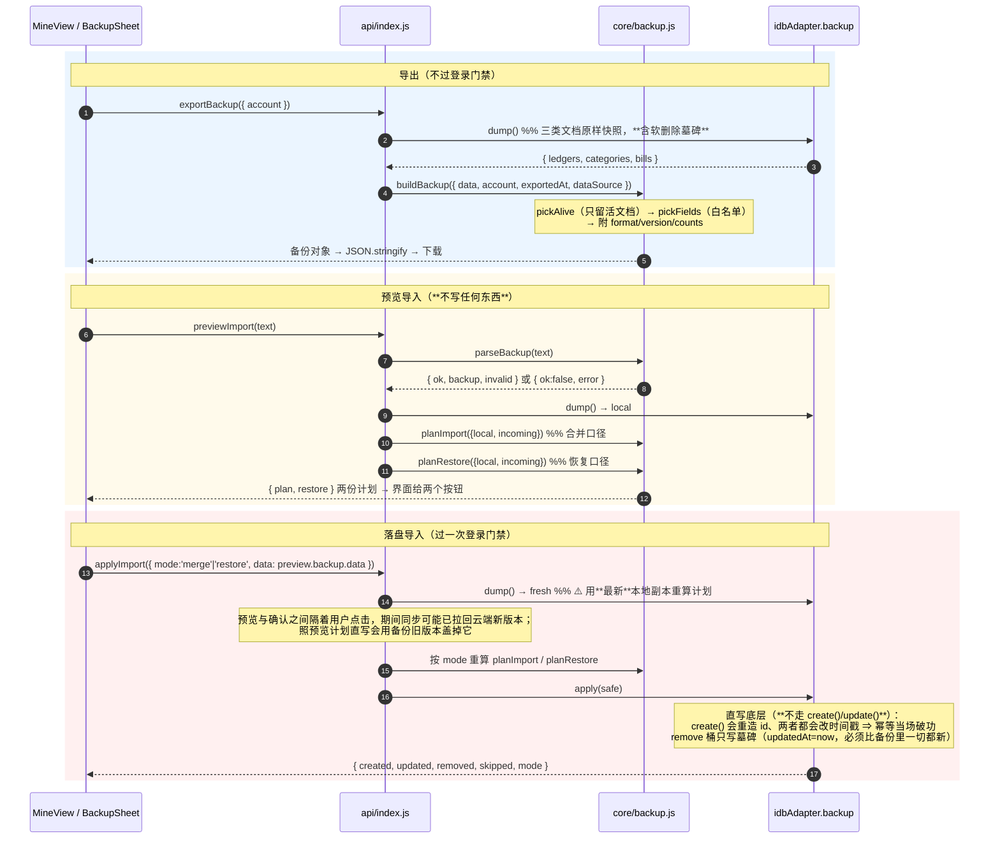


**为什么合并模式下「导出 → 删错 → 再导入」**&#x4E0D;恢&#x590D;**：** 本项目的删除是软删（留墓碑 + `updatedAt` 抬到删除时刻），  
而备份里的 `updatedAt` 是导出时刻 —— 删除必然晚于导出 ⇒ 墓碑永远更新 ⇒ 整条跳过。  
这个场景由**恢复模式**承担，而不是放宽合并规则（那会同时破坏「旧备份不覆盖新数据」）。

**幂等怎么来的**：写库时**保留备份里的 `updatedAt` / `createdAt`**（不改成导入时刻）。  
第二次导入同一份文件时「本地 updatedAt === 备份 updatedAt」，合并模式不满足严格大于 ⇒ 全部 skip。  
**导入两次 = 导入一次。** ⚠️ 若哪天有人改成「改写 `updatedAt = now()`」，幂等立刻破功。

---

## 4. 模块接口说明

> 每个模块按「职责 / 导出 / 方法签名 / 返回 / 副作用与不变量」组织。  
> **签名为准**：括号里的参数是必填，方括号是可选。

### 4.1 `src/api/contract.js` — 数据层契约

**职责**：定义「视图与 store 认的形状」，以及所有适配器必须实现的接口清单。**无实现、无 IO**。

| 导出                               | 类型                                                    | 说明                                                                                                                      |
| -------------------------------- | ----------------------------------------------------- | ----------------------------------------------------------------------------------------------------------------------- |
| `SCHEMA_VERSION`                 | `1`                                                   | 已落库的**数据结构**版本。⚠️ **不是** `DB_VERSION`（见 4.4）                                                                            |
| `COLLECTIONS`                    | `{LEDGER:'ledger', CATEGORY:'category', BILL:'bill'}` | 集合名（单数，契约层用）                                                                                                            |
| `BILL_TYPES`                     | `{EXPENSE, INCOME, TRANSFER, LENDING}`                | 账单类型枚举。UI 只写前两个                                                                                                         |
| `CATEGORY_TYPES`                 | `{EXPENSE, INCOME}`                                   | 分类类型                                                                                                                    |
| `NAME_MAX_LENGTH`                | `8`                                                   | 分类名上限（适配器校验用）                                                                                                           |
| `NotImplementedError`            | class                                                 | 未实现接口的占位错误                                                                                                              |
| `RepositoryError(code, message)` | class                                                 | 带 `code` 的业务错误（`NOT_FOUND` / `INVALID_AMOUNT` / `DUPLICATE_NAME` / `EMPTY_NAME` / `NAME_TOO_LONG` / `PARENT_NOT_FOUND`） |

**适配器契约（两个实现必须一致，`contract-test` 对照覆盖）**：

```text
ledger:   list() | get(id) | update(id, patch)

category: list({ ledgerId?, type?, parentId?, includeDeleted? }) | get(id)
          | create({name, icon, parentId, type, ledgerId})
          | update(id, patch) | remove(id, { cascade=true })
          | listChildren(parentId) | reorder(orderedIds)

bill:     list({ ledgerId?, month?, from?, to?, date?, type?, categoryId?, keyword?, order? })
          | get(id) | create(payload) | update(id, patch) | remove(id)
          | summary({ ledgerId?, month?, from?, to? })
          | listByMonthGroups / listGrouped({ ledgerId, month })
          | remarkHistory({ ledgerId, categoryId, limit })

sync:     pendingCount()

（适配器额外提供，不在视图可见契约内）
          outbox · syncStore · kv · backup · ready() · enqueueAll()
          reset() · clearLocalData() · deleteLocalData() · snapshot()   ← 调试/账号用
```

> **`month` 与 `from`/`to` 是两套等价写法**：`month`（`'YYYY-MM'`）与 `from`/`to`（`'YYYY-MM-DD'`，含首尾）  
> 同时传入时按 **AND** 处理。账单页「按月/按年」筛选统一用 `from`/`to` 表达区间。

### 4.2 `src/api/index.js` — 装配层

**职责**：唯一装配点。对外暴露**稳定代理**，内部指针随账号切换而更换。

| 导出                                         | 类型                                                                | 说明                                                               |
| ------------------------------------------ | ----------------------------------------------------------------- | ---------------------------------------------------------------- |
| `DATA_SOURCE`                              | `'idb'`                                                           | 数据源开关。切回 `'mock'` 只需改这一行                                         |
| `PARTITION_DB_BY_ACCOUNT`                  | `boolean`                                                         | 是否按账号分区库名（可回退开关）                                                 |
| `cloud`                                    | `cloudbaseAdapter \| null`                                        | **单例**，不随后端分区重建（登录态在它内部维护）                                       |
| `ledgerRepo` / `categoryRepo` / `billRepo` | `Proxy`                                                           | repository 代理，转发到当前分区实例                                          |
| `db`                                       | `Proxy`                                                           | 适配器代理（`db.ready()` / `db.reset()` / `db.backup.*` 等）             |
| `syncEngine`                               | `Proxy`                                                           | 同步引擎代理（`sync` / `start` / `stop` / `onStateChange` / `snapshot`） |
| `initDataLayer()`                          | `async`                                                           | 启动时确定身份 → 选库 → 建实例。**不创建账号**                                     |
| `rebuildForAccount(uid)`                   | `{dbName, changed, syncEngine}`                                   | 切换分区：停旧引擎 → 换指针 → 返回新引擎（不自动 start）                               |
| `currentDbName()`                          | `string\|null`                                                    | 当前分区库名（UI 显示）                                                    |
| `enqueueLocalForCloud()`                   | `Promise<number>`                                                 | 把本分区已有文档整体入队一次（幂等）                                               |
| `exportBackup(opts)`                       | `Promise<Object>`                                                 | 导出对象（交给 `JSON.stringify`）                                        |
| `previewImport(text)`                      | `Promise<{ok, backup, invalid, plan, restore}\|{ok:false,error}>` | 预览，**不写任何东西**                                                    |
| `applyImport({mode, data})`                | `Promise<{created,updated,removed,skipped,mode}>`                 | 落盘导入（写前重算计划）                                                     |

**为什么用 `Proxy` 而不是「每次调用查一遍」的包装函数**：`billRepo.list()` 这类调用点一个都不用改，  
`typeof billRepo.list === 'function'` 也照样成立。ESM 静态 `import` 的绑定无法在异步身份确定后重新赋值，  
代理是唯一能保持「模块级导出永不改变」的解法。

**`buildInstance(dbName)` 的选项矩阵**（每个分区差别很大，这是最容易改错的地方）：

| 选项                      | `ledger_guest`（未登录） | `ledger_<前缀>`（已登录） | 说明                             |
| ----------------------- | ------------------- | ------------------ | ------------------------------ |
| `seed`                  | `'base'`            | `'base'`           | 只播账本 + 分类，**一条演示账单都没有**        |
| `seedCategoryUpdatedAt` | `null`（= 用 `ts`）    | `0`（优先级最低）         | 登录分区必须传 0，否则本地默认分类会盖掉云端用户改过的名字 |
| `purgeSeedBills`        | `true`              | `false`            | guest 里账单只可能来自种子，整批清一次（幂等标记）   |
| `migrateFrom`           | `false`             | `false`            | **S7-10 起一律不继承裸库**（见下）         |

> **S7-10 为什么关闭裸库继承**：原设计让第一个登录的账号认领裸库 `ledger`，把第一阶段老数据顺过来。  
> 真机实测（2026-10-02）发现它会**击穿 S7** —— 裸库里躺着一整套演示账单（44 条，¥8720.72），  
> 账号分区一旦继承，`enqueueLocalForCloud()` 会把它们**整体入队**推到真实账号名下，新账号凭空多出演示账。  
> 现在登录后只信云端（拉取覆盖本地）。适配器仍保留 `migrateFrom` / `claimant` 能力，只是**装配层不再使用**。

### 4.3 `src/api/core/query.js` — 查询与派生（纯函数）

**职责**：过滤、排序、聚合、派生字段。**无 IO、不 import 适配器**。

| 导出                                 | 签名                                               | 返回                                                                                                | 说明                                                |
| ---------------------------------- | ------------------------------------------------ | ------------------------------------------------------------------------------------------------- | ------------------------------------------------- |
| `alive(doc)`                       | `→ boolean`                                      | `!doc.deleted`                                                                                    | 软删除标记：`1` / `true` 视为已删                           |
| `createCategoryLookup(categories)` |                                                  | `{ get(id), label(id) }`                                                                          | 建 Map 一次，避免每条账单都重扫数组；`label` 产出「交通-公交地铁」          |
| `filterCategories(cats, query)`    | `{ledgerId?, type?, parentId?, includeDeleted?}` | `Category[]`                                                                                      | 排序 = `order` 升序，**`order` 相同用 `id` 兜底**           |
| `decorateBill(bill, lookup)`       |                                                  | `Bill & {categoryName, categoryIcon, primaryCategoryName, primaryCategoryIcon, displayName}`      | 派生字段**不落库**                                       |
| `filterBills(bills, cats, query)`  | 见契约                                              | `Bill[]`                                                                                          | 关键字匹配备注 / 分类展示名 / 金额文本；排序先按 `date` 再按 `createdAt` |
| `groupBillsByDate(rows)`           |                                                  | `[{date, income, expense, items}]`                                                                | 账单页流水视图                                           |
| `dailySummaryOf(rows)`             |                                                  | `[{date, income, expense, count}]`                                                                | 日历视图                                              |
| `summarizeBills(bills, query)`     |                                                  | `{month, from, to, expense, income, balance, budget, remain, dailyAvg, daysElapsed, daysInMonth}` | 区间汇总；`budget`/`remain` 恒 0（预算功能未做）                |
| `remarkHistoryOf(bills, query)`    | `{ledgerId, categoryId, limit=15}`               | `string[]`                                                                                        | 同一条备注去重、保留最近保存时间、从新到旧                             |

**为什么排序必须用 id 兜底**：`order` 只在「同级同类型」内唯一，一级与二级之间会大量重复。  
只按 `order` 排的话，相同 `order` 的相对顺序取决于底层存储的返回顺序 —— **内存数组是插入序、  
IndexedDB 是按主键序**，两个适配器会给出不同结果。`core/idb.js` 顶部明确写着「存储的返回顺序不是契约」。

### 4.4 `src/api/core/idb.js` — IndexedDB 原语

**职责**：与业务无关的库操作 + 连接自愈 + 分区搬迁。

#### 常量

| 导出                    | 值                                    | 说明                                                                  |
| --------------------- | ------------------------------------ | ------------------------------------------------------------------- |
| `DB_NAME`             | `'ledger'`                           | **未分区**库名（S5 之前的老家）                                                 |
| `DB_VERSION`          | `3`                                  | **只影响 objectStore / 索引结构**。⚠️ **与 `SCHEMA_VERSION` 是两回事**           |
| `DB_PARTITION_PREFIX` | `'ledger_'`                          | 分区库前缀                                                               |
| `LEGACY_DB_KEY`       | `'ledger.db.v1'`                     | 第一阶段 localStorage 数据键                                               |
| `LEGACY_OUTBOX_KEY`   | `'ledger.outbox.v1'`                 | 第一阶段 localStorage 队列键                                               |
| `STORES`              | `{LEDGER,CATEGORY,BILL,OUTBOX,META}` | objectStore 名                                                       |
| `META_KEYS`           | 见 7.2                                | meta 表的键                                                            |
| `toPlain(doc)`        | `JSON.parse(JSON.stringify(doc))`    | **写入前必须**：IndexedDB 结构化克隆处理不了 Vue 的 Proxy，直接 put 抛 `DataCloneError` |

> **`DB_VERSION` vs `SCHEMA_VERSION`（最危险的混淆点）**
>
> |       | `DB_VERSION`（3）            | `SCHEMA_VERSION`（1）            |
> | ----- | -------------------------- | ------------------------------ |
> | 存在哪   | 代码常量，传给 `indexedDB.open()` | 记在 `meta` 表的 `schemaVersion` 键 |
> | 管什么   | objectStore / 索引结构         | 「这个库初始化过没有」→ 决定**要不要播种**       |
> | 动它的后果 | 触发 `onupgradeneeded`，安全    | 对不上就**重新播种，用种子覆盖用户数据**         |
>
> **升级索引结构用 `DB_VERSION`；补数据用独立 meta 标记（如 `SEED_EXTRA_VERSION` + `migrate()`）。  
> 绝对不能拿 `SCHEMA_VERSION` 当迁移版本号。**

#### 函数

| 导出                                                                                   | 签名                              | 说明                                               |
| ------------------------------------------------------------------------------------ | ------------------------------- | ------------------------------------------------ |
| `partitionedDbName(prefix)`                                                          | `→ 'ledger_<prefix>'`           | 前缀为空退回裸 `DB_NAME`（不返回 `ledger_` 这种半截名字）          |
| `isPartitionedDbName(name)`                                                          | `→ boolean`                     | 是否分区库名                                           |
| `openDB({dbName, version})`                                                          | `→ Promise<IDBDatabase>`        | 建库 + 索引；已存在则复用。`onblocked` → reject（提示关闭其它页签）    |
| `isConnClosedError(e)`                                                               | `→ boolean`                     | 识别 `InvalidStateError` / `connection is closing` |
| `createIdbConnection({dbName, version, open?})`                                      | `→ { acquire() }`               | **带探活 + 自动重连的连接**（见下）                            |
| `clearLegacyLocalKeys()`                                                             | `→ boolean`                     | 清两个 localStorage 遗留键（**只在注销时调**）                 |
| `readAll(db, store)` / `readOne(db, store, key)`                                     |                                 | 基础读                                              |
| `putMany(db, store, docs)` / `removeMany(db, store, keys)` / `clearStore(db, store)` |                                 | 基础写（单事务）                                         |
| `readMeta(db)` / `writeMeta(db, patch)`                                              |                                 | meta 键值仓读写                                       |
| `createIdbKeyValue(conn)`                                                            | `→ { get, set, remove }`        | 给 syncEngine 存水位线用。**参数是连接对象，不是裸 Promise**       |
| `migratePartitionData(targetDbPromise, opts)`                                        | `→ {migrated, reason, counts?}` | 把裸库数据搬进分区库（见下）                                   |

**`createIdbConnection` 存在的理由**：Chrome 会**单方面把空闲的 IndexedDB 连接关掉**（清浏览数据后、  
长会话、无痕窗口更容易触发），且不通知页面 —— 下一笔 `transaction()` 才以 `The database connection is closing`  
爆出来。旧的「`dbPromise ||= openDB(...)` 一缓存到底」写法有两个坑：① 连接死了缓存的 Promise 还「成功」着，  
之后永不恢复；② 打开失败（如 `onblocked`）同样被永久缓存，连重开机会都没有。  
`acquire()` 在返回句柄前做一次**探活**（建一个即弃的只读事务再 abort），探活用 `meta` 表（五个表里开销最小）。

**`migratePartitionData` 的四种 `reason`**（调用方据此决定要不要播种）：

| `reason`             | 含义           | 要不要播种               |
| -------------------- | ------------ | ------------------- |
| `migrated`           | 真搬到东西了       | **不播**（会与旧数据叠成两套）   |
| `empty-source`       | 旧库是空的（全新设备）  | **要播**，否则新用户看到空 App |
| `target-not-empty`   | 目标库已有数据      | 不播（内容已定案）           |
| `already-migrated`   | 本分区已继承过      | 不播                  |
| `claimed-by-other`   | 裸库属于**别的账号** | 不播（播种会让新账号凭空多出别人的账） |
| `source-unavailable` | 旧库被占着打不开     | 不播（**不写标记**，下次重试）   |

> 曾经把「旧库为空」也返回成 `migrated`，结果全新设备第一次启动就跳过播种、首页全是 0.00 ——  
> 这是个只有真机首启才暴露的 bug。

### 4.5 `src/api/core/merge.js` — 冲突裁决

| 导出                                                      | 签名                                           | 说明                                                                      |
| ------------------------------------------------------- | -------------------------------------------- | ----------------------------------------------------------------------- |
| `MERGE`                                                 | `{TAKE_REMOTE:'remote', KEEP_LOCAL:'local'}` | 裁决结果枚举                                                                  |
| `fromRemote(doc)`                                       | `→ localDoc \| null`                         | 剥掉 `_id` / `_openid` / `_serverTs`，用**业务字段 `id`** 还原本地 id（拿不到才退回 `_id`） |
| `shouldTakeRemote(localDoc, remoteDoc, clockOffset=0)`  | `→ boolean`                                  | 「该不该采纳远端那份」                                                             |
| `partitionRemote(localDocs, remoteDocs, clockOffset=0)` | `→ {take, keep}`                             | 分流：该采纳的 / 该保留本地的                                                        |

**`fromRemote` 为什么刻意不做「从别名反解析本地 id」**：别名格式一改、或本地 id 自身带下划线，解析就会错。  
**业务字段才是权威来源** —— 这就是「本地 id 同时写进 `payload.id`」这件事存在的意义。

**`keep` 的那部分必须继续留在 outbox 里**等下一轮推送，否则本地这次改动就永远上不了云。

### 4.6 `src/api/core/cloudId.js` — 云端 id 映射

| 导出                           | 值 / 签名                   | 说明                                       |
| ---------------------------- | ------------------------ | ---------------------------------------- |
| `CLOUD_ID_PREFIX_LENGTH`     | `8`                      | 账号前缀长度（碰撞概率与 id 长度的折中）                   |
| `GUEST_ACCOUNT_PREFIX`       | `'guest'`                | 未登录分区前缀（旧名 `'anon'` 已废弃）                 |
| `CLOUD_ID_SEPARATOR`         | `'_'`                    | 别名分隔符（靠**位置**切分，不靠 split）                |
| `accountPrefixOf(uid)`       | `→ string`               | 去非字母数字 → 截 8 位 → 小写；取不到 uid 返回 `'guest'` |
| `toCloudId(localId, prefix)` | `→ '<prefix>_<localId>'` | 本地 id → 云端别名                             |
| `toLocalId(doc)`             | `→ string\|null`         | 优先取业务字段 `id`，退回 `_id`                    |

**这一层为什么存在**（S4-7 方案 A）：CloudBase 的 `_id` 在**整个集合内全局唯一（跨账号）**，  
而 `PRIVATE` 权限按 `_openid` **隔离读**。两者层级错位撞出一个真实缺陷：  
新身份读不到旧身份写的文档（读被隔离），但那个 `_id` 已被旧身份占着（写不隔离）⇒  
「清浏览器数据 / 换设备 → 新身份」时客户端**看不见** `ledger_default` 已被占用，只管写 ⇒ 服务端抛  
`E11000 duplicate key` ⇒ **首次绑定永久失败，outbox 永远排不空**。  
种子账本 id 是常量 `ledger_default`、账单 id 也来自固定种子，所以这不是理论风险。

修法：把 `_id` 的唯一性范围收进账号内（别名），**本地 id 保持不变**并同时写进业务字段 `id`。  
这样本地 id 保持设备无关 → 跨设备合并、种子数据、导出都照旧；视图/store/契约**零改动**。

> 只服务云适配器。mock / idb 适配器不 import 它（本地库里没有 `_id` 概念）。

### 4.7 `src/api/core/migrate.js` — 演示数据增量迁移

| 导出                             | 签名                            | 说明                                     |
| ------------------------------ | ----------------------------- | -------------------------------------- |
| `migrateSeedData(bills, meta)` | `→ {changed, added, updated}` | **只补不覆盖**（按 id 回填）、**幂等**（靠 meta 版本标记） |

两条硬规则：① 只补不覆盖 —— 按 id 回填，**绝不改动用户自己记的账**；② 幂等 —— 重复执行结果不变。  
`bills` 与 `meta` 都是**原地修改**；返回的 `added` / `updated` 供适配器做增量落盘。


> ⚠️ **绝对不要为了补演示数据去 bump `SCHEMA_VERSION`** —— 那会让适配器认定数据结构不兼容而**重新播种**，  
> 把用户自己记的账清空。补数据走 `SEED_EXTRA_VERSION`（独立 meta 标记）。

### 4.8 `src/api/core/backup.js` — 备份逻辑（纯逻辑）

| 导出                                                     | 签名                                                  | 说明                                 |
| ------------------------------------------------------ | --------------------------------------------------- | ---------------------------------- |
| `BACKUP_FORMAT`                                        | `'suishou-ledger-backup'`                           | 文件标识（导入时校验）                        |
| `BACKUP_VERSION`                                       | `1`                                                 | 格式版本。导入端**只接受 <= 自己的版本**           |
| `BACKUP_COLLECTIONS`                                   | `['ledgers','categories','bills']`                  | **复数**键名（给人看的文件不带集合单数名）            |
| `isAlive(doc)` / `pickAlive(docs)`                     |                                                     | 活文档判定 / 过滤                         |
| `buildBackup({data, account, exportedAt, dataSource})` | `→ Object`                                          | 打包（**不负责序列化**）                     |
| `parseBackup(text\|obj)`                               | `→ {ok:true, backup, invalid} \| {ok:false, error}` | 解析 + 逐条校验规范化 + 同 id 去重             |
| `planImport({local, incoming})`                        | `→ {create, update, counts}`                        | **合并**口径                           |
| `planRestore({local, incoming})`                       | `→ {create, update, remove, counts}`                | **恢复**口径                           |
| `isPlanEmpty(plan)`                                    | `→ boolean`                                         | ⚠️ 必须一并考虑 `remove`（只清理不新增也是「有事可做」） |
| `backupFileName(at)`                                   | `→ '随手记账-2026-10-02-1803.json'`                     | 用**本地时间**拼（用户找文件时对得上手表）            |

**两种导入模式的规则差异**（一条规则服务不了两个诉求，所以都实现）：

| 情形            | `planImport`（合并，默认、安全）    | `planRestore`（恢复，不可逆）             |
| ------------- | ------------------------- | --------------------------------- |
| 备份有、本地没有      | 新增                        | 新增                                |
| 两边都有          | 比 `updatedAt`，**严格大于**才覆盖 | 内容不同即覆盖，**不看 `updatedAt`**（备份即真相） |
| 本地是墓碑、备份活着    | **跳过**（墓碑更新，有意为之）         | **复活**                            |
| 本地有、备份里没有的活文档 | **一条都不动**                 | 进 `remove` 桶 → 软删                 |
| 账本保护          | —                         | 备份里没有账本时**不删本机账本**                |

**字段白名单**（`FIELDS`）：显式列举，于是同步元数据（`serverUpdatedAt` 等）不会混进备份文件，  
将来加内部字段时备份格式也不会被动变化。`deleted` 不在名单里（导出只取活文档，导入写回统一补 `deleted: 0`）。  
代价是加业务字段要同步维护白名单 —— 由 `backup-test` 的往返断言兜底。

**校验尺度**：只校验「会弄坏界面的东西」（缺 id / 金额非法 / 日期非法 / 类型不在枚举里）。  
名称长度之类的**业务约束不在这里卡** —— 那是编辑器的事，备份里的历史数据要能原样进出  
（比如早期版本允许的 9 字分类名）。

### 4.9 `src/api/adapters/idbAdapter.js` — 本地权威存储

**职责**：实现完整契约，数据落在 IndexedDB。业务规则**一律调 `core/`**，这里只做「取数 → 写回」。

```js
createIdbAdapter({
  dbName = DB_NAME,               // 分区库名
  version = DB_VERSION,           // 索引结构版本
  seed = true,                    // true|'full' = 含演示账单；'base' = 只播基础设施；false = 空库
  seedCategoryUpdatedAt = null,   // 播种分类的专用 updatedAt（登录分区必须传 0）
  migrateFrom = false,            // 继承旧裸库（装配层已一律 false）
  claimant = '',                  // 裸库认领标识（账号前缀）
  purgeSeedBills = false          // 未登录分区的一次性演示账单清理
}) → {
  name: 'idb', dbName,
  ledger: { list, get, update },
  category: { list, get, listChildren, create, update, remove, reorder },
  bill: { list, listGrouped, get, create, update, remove, summary, dailySummary,
          recent, remarkHistory },
  sync: { pendingCount, clearOutbox },
  backup: { dump, apply },
  outbox, syncStore, kv, ready, enqueueAll,
  reset, clearLocalData, deleteLocalData, snapshot    // 调试/账号用
}
```

**`ready()` 是所有对外方法的第一步**：`initPromise ||= init()`，保证「建库 → 接管/播种 → 迁移」只跑一次。  
`init()` 的执行顺序（**顺序本身是设计**）：

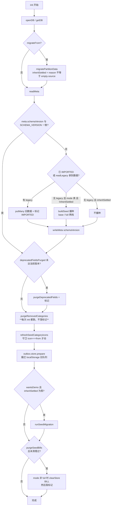

**幂等清理器一览**（三个「不变式」型清理器，语义各不相同）：

| 函数                         | 触发频率          | 守卫                               | 动 `updatedAt`？ | 入 outbox？ | 理由                                          |
| -------------------------- | ------------- | -------------------------------- | -------------- | --------- | ------------------------------------------- |
| `purgeDeprecatedFields`    | 一次（meta 版本标记） | 字段存在才删                           | **否**          | **否**     | 纯存储卫生。抬时间戳会把这笔账判成「本地更新」推送，既去改云端又可能顶掉别设备的新修改 |
| `purgeRemovedCategories`   | **每次 init**   | id 在 `REMOVED_SEED_CATEGORY_IDS` | **否**          | **否**     | 这是**不变式**（该分类不该存在于任何库），要能自愈「云端残留被全量回拉」的时序问题 |
| `refreshSeedCategoryIcons` | **每次 init**   | `icon === from` 才动               | **否**          | **否**     | 视觉刷新不是数据变更。用户自己改过图标就不碰                      |

**`reset()` vs `clearLocalData()` vs `deleteLocalData()`（三者差别必须记牢）**：

|                    | `reset()`                             | `clearLocalData()` | `deleteLocalData()` |
| ------------------ | ------------------------------------- | ------------------ | ------------------- |
| 清业务表 + outbox      | ✅                                     | ✅                  | ✅                   |
| 清 meta             | ✅（但保留 `IMPORTED` / `OUTBOX_IMPORTED`） | 部分（**只清水位线**）      | ✅（全抹）               |
| 清 localStorage 遗留键 | ❌                                     | ❌                  | ✅                   |
| 清 `initPromise`    | ✅（重新播种）                               | ❌                  | ✅                   |
| 用途                 | 「我的 → 重置演示数据」（仅 DEV，DEV 下抬档 FULL）     | 退出登录               | 注销账号                |

**`enqueueAll()` 的意义**：登录后的账号分区里，基础设施（账本 + 默认分类）是 `putMany` **直写的**、  
不走写路径，所以不在 outbox 里。不补这一步，全新账号的默认分类就**永远上不了云** ——  
「换设备用手机号登录，分类还是齐的」就不成立。幂等靠 `meta.localPushedToCloud`。

### 4.10 `src/api/adapters/mockAdapter.js` — 内存测试基座

**职责**：纯内存、零持久化，与 `idbAdapter` 实现**同一套契约**（`contract-test` 对照断言两者行为一致）。  
`DATA_SOURCE = 'mock'` 时启用，主要用于契约测试与本地调试。

额外提供 `reset()` / `snapshot()`（同步返回，便于测试直接读内部状态）。  
可选用 `persistKey` 落 localStorage（默认 `'ledger.db.v1'`，与第一阶段旧库同键，用于测试「接管」逻辑）。

### 4.11 `src/api/adapters/cloudbaseAdapter.js` — 云端副本

**职责**：实现 `sync/cloudClient.js` 的 3 个方法（`pull` / `push` / `serverTime`）+ **账号体系**。  
**不是**一个 repository 实现 —— 同步是「跨集合、跨存储」的行为，由 syncEngine 调度。

```js
createCloudBaseAdapter({
  env,                       // 环境 ID（必填）
  pageLimit = 100,
  persistence = 'local',     // 登录态持久化方式
  loadSdk = () => import('@cloudbase/js-sdk')   // 动态 import，拆独立 chunk
}) → {
  name: 'cloudbase', env,
  pull, push, serverTime,                 // cloudClient 契约
  ensureSignedIn, getIdentity,            // 身份（只复用，不创建）
  sendSmsCode, signInWithSms, signOut,    // 账号能力
  deleteAccount,                          // 注销（= wipe，必须在登出前调）
  wipe,                                   // 清空本账号全部文档（调试/注销共用）
  onAuthChange(cb),
  get uid, get signedIn, get accountPrefix, get lastError
}
```

**关键方法细节**：

| 方法                                               | 语义           | 关键约束                                                                                                       |
| ------------------------------------------------ | ------------ | ---------------------------------------------------------------------------------------------------------- |
| `pull(collection, {since, cursor, limit, ids})`  | 增量拉取         | `ids` 分支**不推进水位线**（`serverTime: 0`）—— 它不是按区间扫描的                                                            |
| `push(collection, docs, {clockOffset})`          | 条件 upsert    | ① 按别名批量读回云端版本 ② 调 `shouldTakeRemote(local, cloud, offset)` 裁决 ③ `.set()` 整份覆盖 ④ 调云函数盖刻度                    |
| `serverTime()`                                   | 两级实现         | 首选 HTTP 网关（`source:'cloud-function'`，**可裁决**）；降级取最新 `_serverTs`（`source:'watermark-lower-bound'`，**仅水位线**） |
| `ensureSignedIn()`                               | 拿**已存在**的登录态 | 名字保留、语义已变：**不再自动创建匿名账号**，拿不到就抛 `NOT_SIGNED_IN`                                                             |
| `getIdentity()`                                  | 只读身份         | **不触发登录**；**匿名身份返回 `uid: null`**（S7-1）                                                                     |
| `sendSmsCode(phone)`                             | 发验证码         | ⚠️ 字段名是 `phone_number` **不是** `phone`（SDK 命名不一致，照直觉写会静默失败）                                                 |
| `signInWithSms({phone, code, verificationInfo})` | 登录/注册        | 老 API，返回 `LoginState`；`verificationInfo` **必传**                                                            |
| `deleteAccount()`                                | 清空本账号云端数据    | **必须在登出之前调**（登出后 `wipe` 第一步 `ensureSignedIn` 就抛）                                                           |

**为什么走 HTTP 网关而不 `app.callFunction()`**：实测 Web SDK 的 `callFunction` 在注册/登录态下会返回  
403 `EXCEED_AUTHORITY`（云函数默认安全规则要求「登录且非匿名」）。用 `managePermissions` 放开该规则  
**实测无效**（接口回 Success 但复读仍是原规则）。HTTP 网关的 `EnableAuth=false` 是真实生效的。

**`getAuth()` 必须缓存**：SDK 的 auth 实例自己持有会话/内存态（`currentUser`、刷新定时器、事件订阅）。  
每次 `app.auth()` 现取新对象会出现「A 实例登录了，B 实例的 `currentUser` 还是 null」。

**`normalizeIdentity` 的取舍**：`isAnonymous` 拿不准时**倾向判为「匿名」** ——  
UI 上多显示一次「未登录」没有坏处，反过来（把匿名当正式账号）会让用户以为数据已经安全了，  
而实际上清掉浏览器就全没了。这个误判的代价不对称。

### 4.12 `src/api/sync/cloudClient.js` — 云接口契约（无实现）

| 导出                          | 说明                             |
| --------------------------- | ------------------------------ |
| `CLOUD_PAGE_LIMIT`          | `100`                          |
| `CLOUD_METHODS`             | `['pull','push','serverTime']` |
| `assertCloudClient(client)` | 启动时校验接口对齐（否则要等第一次同步才炸）         |

**三个方法的语义**（S2 的 fakeCloud 与 S3 的 cloudbaseAdapter 实现同一套，所以接真云端时 syncEngine 一行没改）：

```text
pull(collection, { since, cursor, limit, ids }) → { docs, serverTime, hasMore, cursor }
  since  = 水位线（只要 updatedAt 严格大于它的文档，首次传 0）
  ids    = 精确拉取指定**本地 id**（推送被拒后回拉云端版本用）
  docs   **必须带 updatedAt**，合并规则完全依赖它

push(collection, docs, { clockOffset }) → { upserted: string[], rejected: [{id, cloudUpdatedAt}] }
  幂等键是云端 _id；upserted 与 rejected[].id 都是**本地 id**
  ⚠️ rejected 是关键：云端因「你这份更旧」拒绝却不告诉客户端 ⇒ 客户端以为推成功、
     云端还停在旧版本 ⇒ 两端静默分叉（单设备测不出来）

serverTime() → { value: <毫秒>, source: 'cloud-function' | 'watermark-lower-bound' }
  返回**带 source 的对象**而非裸数字 —— 调用方据此决定敢不敢拿它裁决
```

**id 在契约层一律用「本地 id」**：云端内部把 `_id` 做成什么形状是**实现细节**，不该泄漏到这里。

### 4.13 `src/api/sync/syncEngine.js` — 同步调度骨架

```js
createSyncEngine({
  outbox, store, cloud,
  collections = [ledger, category, bill],
  meta = null,                  // 键值仓（存水位线）
  watermarkKey = 'syncWatermark',
  debounceMs = 2000, maxRetry = 5, baseDelay = 2000, maxDelay = 60000,
  pageLimit = 100, maxPages = 50,
  now = () => Date.now(),
  timer = {setTimeout, clearTimeout},   // 测试注入
  isOnline = () => navigator.onLine !== false
}) → {
  sync({reason, manual}), schedule(), start(), stop(),
  onStateChange(cb) → unsubscribe,      // 订阅时立刻回调一次当前状态
  snapshot() → {state, pendingCount, lastSyncAt, lastSuccessAt, lastError,
                retry, consecutiveFailures, clockOffset, clockSource, online},
  get state / pendingCount / lastSyncAt / lastSuccessAt / lastError / retry,
  resetWatermark()
}
```

**四个触发源都收敛到 `sync()` 的防重入闸门**：

| 触发源               | reason                                               | manual                                      |
| ----------------- | ---------------------------------------------------- | ------------------------------------------- |
| outbox 变更后防抖      | `'debounced'`                                        | false                                       |
| 引擎启动              | `'startup'`                                          | false                                       |
| 浏览器 online 事件     | `'online'`                                           | **true**（刚恢复网络时 `navigator.onLine` 可能还没翻过来） |
| 退避重试              | `'retry'`                                            | false                                       |
| 手动按钮 / 账号切换 / 退出前 | `'manual'` / `'account-change'` / `'before-signout'` | true                                        |

**防重入是唯一的闸门**：`syncing` 期间再调 `sync()`，返回的是**同一个 in-flight Promise**，  
而不是并发发第二次请求。（反例：调用前判 `state === 'syncing'` 就 return —— 调用方拿不到结果，也没法 await，语义是错的。）

**指数退避** `backoffDelay(retry, {baseDelay=2000, maxDelay=60000, maxRetry=5})`：  
`2s → 4s → 8s → 16s → 32s`，超过 `maxRetry` 返回 `null`（不再自动重试，只等外部触发）。  
单独抽成纯函数是为了能被直接断言 —— 退避表用假定时器倒推太脆。

**`lastSyncAt` vs `lastSuccessAt`（S8-2）**：

|     | `lastSyncAt`                         | `lastSuccessAt`  |
| --- | ------------------------------------ | ---------------- |
| 含义  | **水位线**（拉到的最大 `_serverTs`），服务端时间轴上的值 | 上次成功同步的**本地时刻**  |
| 用途  | 下次拉取的 `since`                        | UI 显示「上次同步」      |
| 持久化 | 落 meta（`syncWatermark`）              | **只在内存**，重启页面归 0 |

> 混用会出「刚刚手动同步过，界面却写着上次同步是昨天」—— 因为云端最新的那条文档就是昨天的。  
> 「上次同步」本质上是**这次使用**的事实，所以不落盘。

### 4.14 `src/api/sync/outbox.js` — 队列语义

```js
createOutbox(store) → {
  store,
  all(), pending(), pendingCount(),
  enqueue(entry), enqueueMany(entries),
  markSynced(ids), bumpRetry(id), bumpRetryAll(),
  drop(ids), compact(), clear(),
  onChange(cb) → unsubscribe
}
```


| 方法 | 说明 |
| --- | --- |
| `enqueue` | 补默认值 `{retry:0, synced:false}`，写库后 `notify()` |
| `enqueueMany` | **合成一次写、一次通知** —— 首次绑定要投递几十条，逐条 enqueue 会开几十次事务、通知几十次 |
| `markSynced` | 标记已推送（**不删**，等 `compact` 批量清） |
| `drop` | 永久移除（该条已被云端否决，本地已采纳云端版本，再推就是把正确版本改回旧的） |
| `compact` | 清掉所有 `synced` 的条目（否则队列无限长） |

**依赖方向是单向的**：适配器 → outbox ← syncEngine。
适配器只往 outbox 丢条目、**不认识 syncEngine**；引擎通过 `onChange` 订阅 —— 这是**依赖反转的接缝**。

### 4.15 `src/api/sync/outboxStore.js` — 队列存储后端

| 导出 | 说明 |
| --- | --- |
| `createMemoryOutboxStore(initial)` | 纯内存（mock 数据源与单元测试用，保持 mock「零持久化」语义） |
| `createIdbOutboxStore({dbName, version})` | IndexedDB 的 `outbox` 表（**与业务数据同库**） |

后端接口（全部 async）：`prepare()` / `all()` / `put(list)` / `remove(ids)` / `clear()`。

**`prepare()` 做一次「队列搬迁」**：把第一阶段留在 localStorage 的 `ledger.outbox.v1` 导入 outbox 表。
两条策略与接管旧库一致：① 导入后**不删**旧键（留作回退）；② 靠 meta 标记（`outboxImported`）保证只导入一次
—— **不能靠「旧键是否为空」判断**，否则用户重置演示数据后会被再导入一遍。

### 4.16 `src/api/sync/errors.js` — 错误分类与处置策略

**解决的问题**：所有同步失败都跳同一个「同步失败」红字，但它们的**正确处置方式完全不同** ——
全归成一类的结果是三个都做错：断网时反复弹红字、登录失效时无限退避、配额用完时还在闷头重试烧资源点。

`SYNC_ERROR_KIND`（**只增不改**，视图按它选文案）：

| kind | 含义 | retryable | needsReauth | silent | label |
| --- | --- | --- | --- | --- | --- |
| `not-configured` | 没配云端（纯本地模式，**不是错误**） | ✗ | ✗ | ✓ | 未配置云端，当前为纯本地模式 |
| `offline` | 浏览器离线 | ✗（靠 `online` 事件恢复更快） | ✗ | ✓ | 当前离线，恢复网络后会自动同步 |
| `network` | 网通了但没到（fetch 抛错/DNS/超时） | ✓ | ✗ | ✗ | 网络不稳定，正在重试 |
| `auth-expired` | 登录态失效 / 未登录 | ✗ | ✓ | ✗ | 登录状态已失效，请重新登录 |
| `server` | 服务端 5xx / 云函数异常 | ✓ | ✗ | ✗ | 云端暂时不可用，稍后会自动重试 |
| `quota` | 配额耗尽 / 频率限制 | ✗ | ✗ | ✗ | 云端额度已用完，同步暂停 |
| `forbidden` | 权限被拒（安全规则） | ✗ | ✗ | ✗ | 云端拒绝了这次同步，请检查权限配置 |
| `conflict` | 主键冲突（E11000） | ✗ | ✗ | ✗ | 数据冲突，请重试一次 |
| `unknown` | 未知（按 server 保守处理） | ✓ | ✗ | ✗ | 同步失败，稍后会自动重试 |

**`needsReauth` 的处置方式在 S7 变了**：以前引擎看到它就**自动重新登录**（那时自动登录 = 开一个匿名账号，
总能成功）。去掉匿名身份后自动重登不可能 —— 只有用户能登录。所以它现在的含义是「**提示用户去登录**」。

**`classifyError(err, {online})`**：优先信适配器打的 `err.kind` → 否则嗅探错误码/HTTP 状态码 → 都失败归 `UNKNOWN`。
嗅探覆盖 `err.code` / `err.error.code` / `err.errCode` / `err.message` 四个位置（CloudBase 各层挂法不同）。

### 4.17 `src/api/sync/fakeCloud.js` — 测试用假云端

一个内存 Map，实现与真云端**一模一样**的接口。除了接口本身，还多带测试必备能力：
`as(openid)` 切身份 / `_failNext(n)` / `_failAlways()` / `_calls()` 调用计数 / `_skew(ms)` 服务端时间偏移 /
`_serverTimeSource(src)` 模拟降级 / `_noServerStamp(true)` 模拟「云函数不可用 → 没盖上刻度」。
⚠️ `push` **也会盖 `serverUpdatedAt`**（与真云端语义一致），否则测试永远测不出跨设备裁决通没通。

### 4.18 `src/api/mock/seed.js` — 种子定义

| 导出 | 说明 |
| --- | --- |
| `SEED_MODE` | `{BASE:'base', FULL:'full'}` |
| `LEDGER_ID` | `'ledger_default'` |
| `CAT_ID(key)` / `SUB_ID(key)` | `cat_<key>` / `sub_<key>`（**固定 id**，便于幂等回填与清理） |
| `REMOVED_SEED_CATEGORY_IDS` | 历史播过、现已废弃的分类 id（`[cat_goose]`） |
| `CATEGORY_ICON_REFRESH` | 种子分类图标换新名单（9 条，`{id, from, to}`） |
| `SEED_EXTRA_VERSION` / `SEED_NOTES_VERSION` | 补充账单 / 备注回填的版本标记 |
| `SEED_BILL_NOTES` | `账单id → 备注` 映射（早期库回填用） |
| `buildExtraBills(ts)` | 补充账单（本月收入 + 往月收支） |
| `buildBase(ts, {categoryUpdatedAt})` | **基础设施**：1 账本 + 41 分类 |
| `buildDemoBills(ts)` | **演示账单**（⚠️ 只在 DEV 构建返回数据，生产返回 `[]`） |
| `buildSeed(ts, {mode, categoryUpdatedAt})` | 组合入口，`mode` 决定要不要带演示账单 |

**种子分两层的理由（S7-9）**：原本捆在一起的种子接云端后成了一条**静默的数据污染链**
（新账号首次登录 → 空分区 ⇒ 播种整套 → 整批推上云 → 账号里凭空多出 ¥8720.72 演示账）。所以按性质拆开：

| 内容 | 性质 | 谁需要 | 播不播 |
| --- | --- | --- | --- |
| 账本 + 分类 | **基础设施** —— 没有它记不了账、宫格是空的 | 全部场景 | **始终播** |
| 演示账单 | **演示数据** —— 某个人编出来的账 | 开发 / 设计稿对照 | **仅 DEV 构建** |

**`DEMO_ENABLED` 写成 `import.meta.env.DEV`（而不是从 `config/env.js` 取 `IS_DEV`）是有意的**：
Vite 在**生产构建时会把这一处整段替换成 `false`**，于是 `buildDemoBills` 里那段账单数据成为死代码，
打包器可以把它摇掉 —— 要的是「**生产包里根本没有演示数据**」，而不是「有数据但运行时不读」。

**分类树现状**：支出 16 个一级（含 5 个带二级）+ 收入 7 个一级 = **41 条分类**。
改分类数要同步改 `partition-test` / `seed-test` / `sync-test` 里写死的条数。

### 4.19 `src/stores/` — 状态层（Pinia）

#### `ledger.js`（账本）
`state: {ledgers, currentId:'ledger_default', loading, initialized}`
`getters: current, currentName` · `actions: ensureLoaded(), switchTo(id)`

#### `category.js`（分类）
`state: {list, loading, initialized}`
`getters`：`byId`（Map）/ `primaries(type)` / `children(parentId)` / `hasChildren(parentId)` / `label(id)` / `tree(type)`
`actions: ensureLoaded(force), createCategory, updateCategory, removeCategory, resolveOrNull(id)`

#### `bill.js`（账单）—— **本文件最容易改错**

**两份互相独立的数据切片**（**禁止合并**）：

| 切片 | 字段 | 谁用 | 加载入口 |
| --- | --- | --- | --- |
| **本月视角** | `month` / `bills` / `summary` | 首页、统计页顶部 | `ensureLoaded()` |
| **账期筛选取景** | `period` / `periodBills` / `periodSummary` / `periodInitialized` | 账单页 + 统计页共用 | `ensurePeriodLoaded()` |

拆开的理由：让账单页/统计页切到某一年时，**首页仍显示本月数据**。

`getters`：`todayBills` / `todayStat` / `groups` / `dailyMap` / `isCurrentMonth` /
`periodRange` / `periodLabel` / `periodUnit` / `periodGroups` / `periodDailyMap` / `periodMonthlyMap` /
`periodTrend` / `periodRankMap`

`actions`：`ensureLoaded(force)` / `refresh()` / `setMonth` / `shiftMonth` /
`ensurePeriodLoaded(force)` / `refreshPeriod()` / `setPeriodMode` / `setPeriodMonth` / `setPeriodYear` /
`shiftPeriod` / `resetPeriod()` /
`createBill` / `updateBill` / `deleteBill` / `getBill` / `remarkHistory(categoryId, limit)` /
`search(keyword)` / `clearSearch()` / `calendarOf(month)`

**写操作必须刷两份切片**：`createBill` / `updateBill` / `deleteBill` 都是
`await this.refresh()` **且** `if (this.periodInitialized) await this.refreshPeriod()`。
`updateBill` 还额外把两个视角移到该账单所属月份（编辑后日期可能跨月/跨年，要保证可见）。

#### `account.js`（账号）—— **顺序即正确性**

`state: {uid, phone, dbName, busy, error, ready}`
`getters: phase`（两态：`formal` / `signedOut`）/ `hasCloud` / `signedIn` / `label`（手机号打码）
`actions`：
- `bootstrap()` —— 启动时探测身份 + 同步进 store（幂等）
- `refreshIdentity()`
- `sendCode(phone)`
- `signInWithPhone({phone, code, verificationInfo})` —— 登录 → 切分区（在 `runIdentityChange` 内）
- `signOut()` —— **先推干净再清本地**
- `deleteAccount()` —— **云端 → 本机 → 登出**（顺序硬约束）
- `runIdentityChange(mutate)` —— 收尾：切分区 → `resetLoadedStores()` → `enqueueLocalForCloud()` → `sync()` → **`resetLoadedStores()` 再刷一次**
- `switchPartition(uid)` — `rebuildForAccount` + 已登录 `start()` / 未登录 `stop()`
- `resetLoadedStores()` — 置假 `initialized`（**含 `bill.periodInitialized`**）+ `bill.resetPeriod()` + 重新加载

### 4.20 `src/composables/` — 可复用交互逻辑

| 文件 | 导出 | 说明 |
| --- | --- | --- |
| `useLoginGate.js` | `shouldAllowWrite({hasCloud, signedIn})` · `requireLogin(label, after?, ctx?)` | 写操作门禁。**纯逻辑**可 Node 断言；`ctx` 是测试注入点。门禁**不是安全边界**（真边界在云端 PRIVATE 权限） |
| `useLoginSheet.js` | `openLoginSheet` / `closeLoginSheet` / `resolveLoginSheet` / `useLoginSheet()` | **模块级单例** reactive 对象（被「我的」页、门禁、路由守卫三处共用）。`pending` 装「登录成功后要接着做的事」 |
| `useRecordDraft.js` | `readRecordDraft` / `writeRecordDraft` / `clearRecordDraft` / `buildRecordDraft` / `isDraftScopedPath` / `installRecordDraftGuard(router)` | 记账页表单草稿，落 localStorage。**只在「记账页 ↔ 分类管理/编辑」往返时保留** |
| `useSwipeViews.js` | `useSwipeViews({views, current, threshold=56, ignoreSelector})` → `{drag, trackStyle, paneStyle, onTouchStart/Move/End, goTo}` | 左右滑动切视图。**先判主方向**（纵向为主则放弃接管，把滚动交还页面）；`ignoreSelector` 命中的区域不参与切换 |
| `useToast.js` | `useToast()` → `{toasts, show, success, error}` | 底部轻提示，全局单例，由 `ToastHost.vue` 渲染 |

### 4.21 `src/utils/` — 纯函数工具

| 文件 | 主要导出 |
| --- | --- |
| `date.js` | `pad2` `toDateKey` `todayKey` `currentMonthKey` `monthKeyOf` `monthFirstKey` `monthLastKey` `yearFirstKey` `yearLastKey` `daysBetween`（按 UTC 算，免时区/夏令时干扰）`addDays` `addDaysToKey` `shiftMonth` `formatMonthLabel` `formatDateDots` `formatDateCN` `daysInMonth` `monthGrid`（周一起始的日历矩阵）`weekdayLabels` `formatClockTime` `formatFullTimeCN` |
| `money.js` | `round2`（`Math.round((n+EPSILON)*100)/100`，避浮点）`formatMoney` `splitMoney` `formatTyping` `toAmount` |
| `id.js` | `uid(prefix)`（`<prefix>_<base36时间><seq><rand>`）· `now()` |

### 4.22 `src/config/` — 配置

| 文件 | 导出 | 说明 |
| --- | --- | --- |
| `env.js` | `cloudEnvId` `cloudApiBase` `isCloudConfigured` `isCloudApiConfigured` `APP_MODE` `IS_DEV` | ⚠️ **只有 `VITE_` 前缀的变量会被注入前端**。集中在这里读一次，其它文件不再直接碰 `import.meta.env`。云端配置缺失时**不抛错、不白屏** |
| `cloud.js` | `CLOUD_COLLECTION_PREFIX` `CLOUD_FUNCTIONS` `CLOUD_RESOURCE_PREFIX` `CLOUD_HTTP_PATHS` | 云端资源命名表。云函数名**跨层共享**（前端调它 / 云函数目录用它 / 部署脚本用它），放一处改名字不会漏 |

> **云端资源一律 `ledger` 前缀**：该 CloudBase 环境**可能被其它项目复用**，所以集合名/函数名/托管路径都带前缀。
> 集合名带前缀 + PRIVATE 权限按 `_openid` 隔离，两层互不干扰。

### 4.23 `src/views/` + `src/components/`

**8 个页面**：

| 路由 | 视图 | `meta` | 说明 |
| --- | --- | --- | --- |
| `/` | `HomeView` | `tab` | 首页总览 + 今日账单（本月切片） |
| `/bills` | `BillsView` | `tab` | 流水 / 日历两视图滑动切换（`period` 切片） |
| `/record` | `RecordView` | `requiresAuth:true, authLabel:'记账'` | 记账 / 改账 |
| `/stats` | `StatsView` | `tab` | 趋势 + 排行（`period` 切片） |
| `/mine` | `MineView` | `tab` | 账号卡片 / 同步状态 / 数据层状态 / 备份 / 打赏 / 注销 |
| `/category` | `CategoryManageView` | `requiresAuth:true, authLabel:'分类管理'` | 一级分类管理（子路由挂二级） |
| `/category/:parentId/sub` | `SubCategoryManageView` | 继承父级 | 二级分类管理（底部弹层） |
| `/category/edit` | `CategoryEditView` | `requiresAuth:true, authLabel:'分类管理'` | 分类新建/编辑 + 图标选择 |

**路由守卫顺序（注册顺序即执行顺序）**：

1. **写操作门禁**（`requiresAuth`）—— 必须**注册在草稿守卫之前**。一旦这里返回 `false`（导航被中止），
   后面的草稿守卫就不会跑；否则「未登录点 + 被拦下」会被草稿守卫误判成「离开了记账链路」。
   - 被拦下后往哪走：**正常导航** → 返回 `false` 停在原页；**直接访问/刷新到受保护路由**
     （`from.name === undefined`，没有「原页」可停）→ 必须显式重定向首页，否则 `router-view` 无匹配组件，
     实测**整页白屏**。
   - `after` 回调 = 登录成功后把这次被拦下的导航**接着做完**。
2. **草稿守卫**（`installRecordDraftGuard`）。

**19 个组件**（按职责分组）：

| 组 | 组件 |
| --- | --- |
| 骨架 | `AppHeader` `TabBar` `BottomSheet` |
| 展示 | `AmountText` `BillRow` `CategoryGrid` `CategoryIcon` `RankList` `TrendChart` |
| 输入 | `NumericKeypad` `RecordPanel` `SubCategoryPanel` `PeriodPicker` `PeriodSwitch` `SearchOverlay` |
| 反馈/确认 | `ToastHost` `ConfirmDialog` `LoginSheet` `BackupSheet` |
| 图标 | `icons/IconBase.vue` + `icons/index.js` + 15 个图标模块 |

**图标系统**（两套风格共用 24×24 画布）：

- **旧线性**：`stroke="currentColor"`，直接写在 `icons/index.js`。
- **十四组填充风**：`icons/{food,shop,...}Fill.js`（生成物），外壳 `<g stroke="none" transform="scale(24/512)">`。
- **覆盖机制**：`ICONS = { ...线性, ...各 *Fill.js }`，末尾展开覆盖同 key —— 历史库**零迁移**自动换新
  （分类只存 key 字符串）。
- **尺寸**：`CATEGORY_ICON_RATIO = 0.65`，由 `CategoryIcon.vue` 消费。
- ⚠️ **别手改路径数据**，重新生成跑 `node scripts/convert-fill-icons.mjs`（多批次 `BATCHES` 配置）。

### 4.24 `cloudfunctions/` — 云端函数

| 函数 | 目录 | 职责 | 返回 |
| --- | --- | --- | --- |
| `ledger-server-time` | `cloudfunctions/ledger-server-time/` | 返回真正的服务端当前时间（`Date.now()`） | `{ok, serverTime, iso, env}` |
| `ledger-sync-stamp` | `cloudfunctions/ledger-sync-stamp/` | 给一批文档盖上服务端裁决刻度（写业务字段 `serverUpdatedAt`），**顺带刷新 `_serverTs`** | `{stamps: {collection: {别名: 毫秒}}}` |


**`ledger-server-time` 刻意不做鉴权**：只读、无参、不碰数据库，任何人调用都只会得到一个时间戳，没有信息泄露。
**`ledger-sync-stamp` 不接受客户端传来的时间**（只接受「要盖哪些 id」）—— 刻度必须由服务端生成，客户端不能伪造。

⚠️ **本地目录名必须与云端函数名完全一致**：CloudBase MCP 的 `createFunction` 用
`functionRootPath + '/' + 函数名` 拼本地路径，不一致直接报「路径不存在」。
（曾经用过下划线目录名，实测失败。）

---

## 5. UML 类图 / 组件图

### 5.1 Repository 契约与两个适配器

两个适配器实现**同一套接口**（`contract-test` 逐方法对照断言），这样切数据源只改 `DATA_SOURCE` 一行。

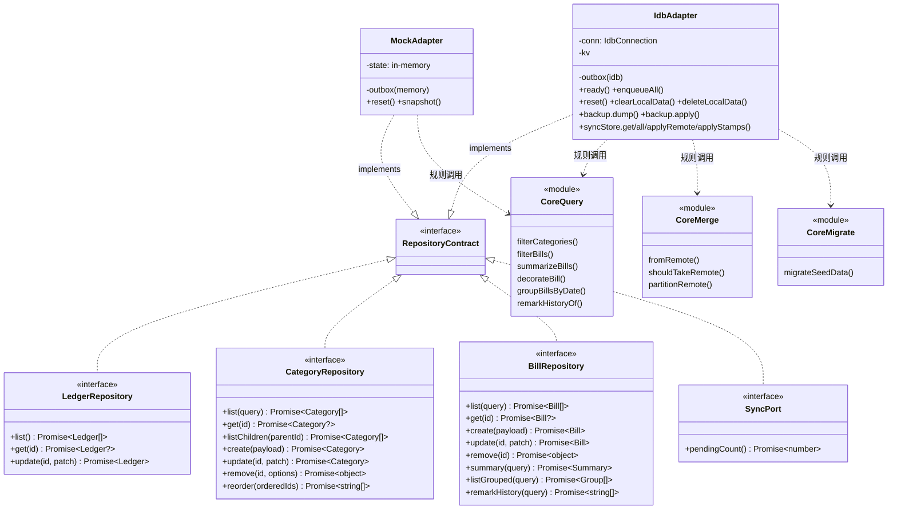

### 5.2 云客户端契约与实现

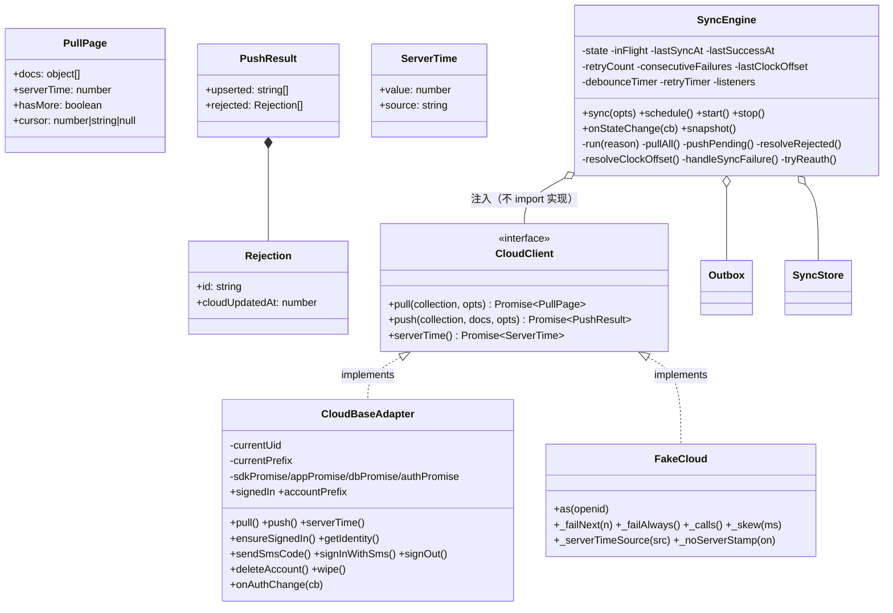

**关键关系**：`SyncEngine` 只依赖 **`CloudClient` 契约**，从不 import 具体实现。
所以 S2（fakeCloud）→ S3（真云端）切换时 `syncEngine.js` 一行未改。

### 5.3 视野层 → 状态层 → 数据层

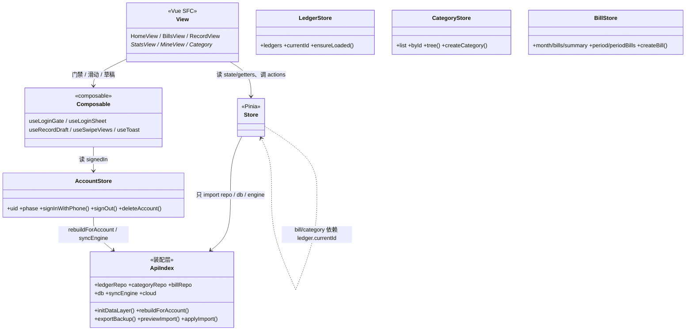

**唯一被允许「越过 store 直连 api」的地方是 `MineView`** —— 它要显示数据层状态
（`db.dbName` / `DATA_SOURCE` / `syncEngine.snapshot()` / `cloud`），这些是**调试与运维信息**，
不是业务数据，没必要为它建一个 store。

---

## 6. 状态机

### 6.1 同步引擎四态

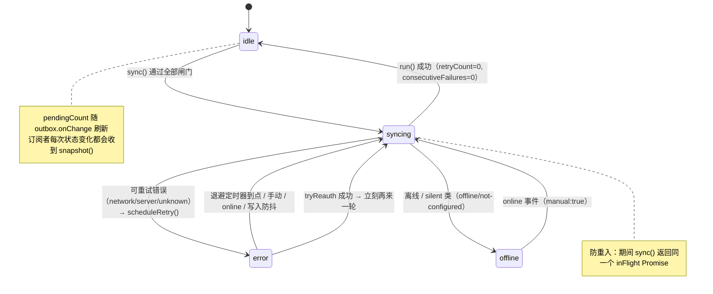

**注意**：`offline` 状态**不排退避重试** —— 恢复路径是浏览器的 `online` 事件（引擎已监听），
事件一到立刻同步一轮，比等退避更快更准。排退避反而会给队列加 retry 计数，
把「本来就离线」显示成「网差在重试」。

### 6.2 账号两态（S7 后由三态收敛）

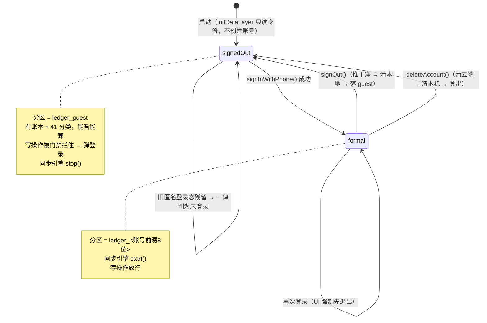

### 6.3 库与水位线生命周期

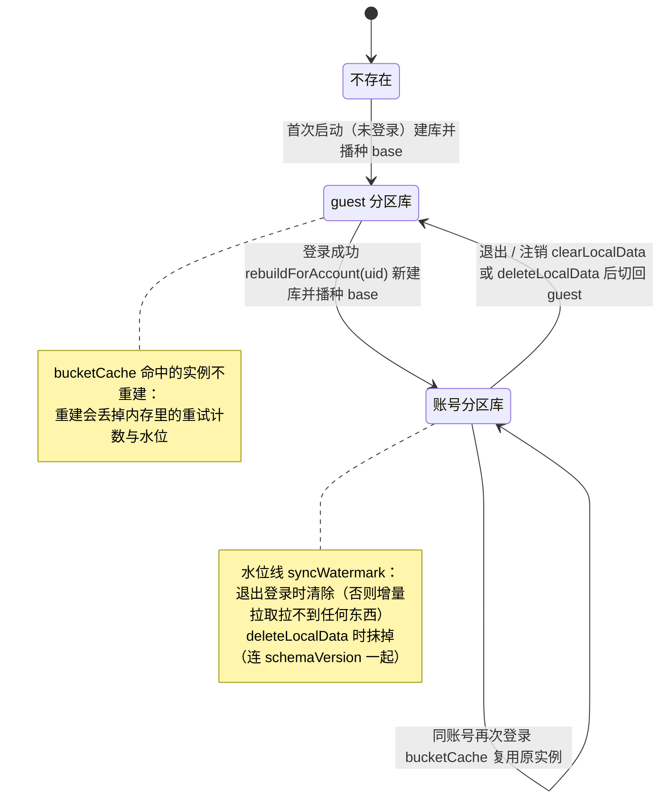

**`bucketCache` 不清空的理由**：同一个账号切回来时应复用原来的引擎与队列 ——
重建会把「还没推上去的本地改动」留在库里、却丢掉内存里的重试计数与水位。

---

## 7. 数据设计（Schema）

### 7.1 三处存储 + 一份交换格式

| 存储 | 位置 | 角色 | 权威性 |
| --- | --- | --- | --- |
| **本地库** | IndexedDB（分区） | **权威副本**（local-first） | 用户操作的唯一落点 |
| **本地队列** | IndexedDB `outbox` 表 | 待推送意图列表 | 「还没同步」的事实来源 |
| **云端** | CloudBase 3 个集合 | 跨设备同步的第二副本 | 换设备时的真相来源 |
| **交换格式** | JSON 文件 | 用户手里的备份 | 防厂商锁定的底线 |

另外还有两处**辅助存储**（不属于业务数据）：

| 位置 | 内容 | 说明 |
| --- | --- | --- |
| `localStorage` | `ledger.recordDraft.v1` | 记账页表单草稿（纯 UI 状态，不过 repository） |
| `localStorage` | `ledger.db.v1` / `ledger.outbox.v1` | **第一阶段遗留键**，只读不写；平时不碰，注销时清掉 |
| `localStorage` | CloudBase SDK 的登录态（4 把钥匙） | 由 SDK 管理；**清掉即永久失联** —— 这就是移除匿名身份的理由之一 |

### 7.2 IndexedDB 库结构

**库名**：`ledger_<账号前缀8位>`（登录）或 `ledger_guest`（未登录）；`ledger` 为旧裸库。
**库版本**：`DB_VERSION = 3`（只影响结构）。

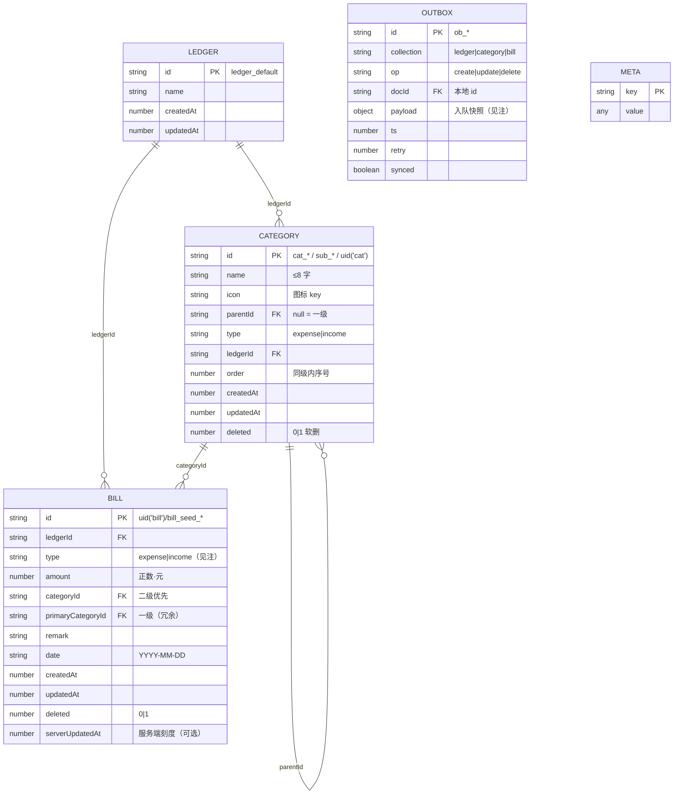

**objectStore 与索引清单**：

| objectStore | keyPath | 索引 | 建在哪一步 |
| --- | --- | --- | --- |
| `ledger` | `id` | — | v1 |
| `category` | `id` | `ledgerId` / `parentId` / `type` / `updatedAt` | v1 |
| `bill` | `id` | `ledgerId` / `date` / `categoryId` / `updatedAt` | v1（`month` 索引已在 v3 删除） |
| `outbox` | `id` | `synced` | v2 |
| `meta` | `key` | — | v2 |

> **索引的现实用法**：适配器的查询是「`getAll` 全表读进内存 → 调 `core/query.js` 过滤排序」。
> 索引目前**只服务于 `getAll` 的读取效率与将来的优化余地**，没有一条查询用到 `where(index)`。
> 这是有意的取舍：个人记账数据量（千条级）下 `getAll` 是毫秒级，用内存计算换取「规则只写一份、
> 两个适配器行为完全一致」。若将来数据量上来，优化点就在这一层（把 `filterBills` 的条件下推到索引）。

> **v3 为什么删掉 `bill.month` 索引**：账单文档里**根本没有 `month` 字段**（月份由 `monthKeyOf(date)` 现算），
> 索引自建立起就是空的，而每次写入都要为它维护一条空条目 —— 纯粹的写入负担。
> 由于 `createObjectStore` 分支只在建新库时跑，已存在的 store 必须在 `onupgradeneeded` 里显式
> `dropIndexIfExists(tx.objectStore(BILL), 'month')`。


### 7.3 逐表逐字段说明

#### 7.3.1 `ledger`（账本）

| 字段 | 类型 | 必填 | 作用 | 设计意图 / 约束 |
| --- | --- | --- | --- | --- |
| `id` | `string` | ✅ | 主键 | 种子固定为 **`ledger_default`**（常量！）。`ledgerStore.currentId` 默认指向它，`getters.current` 在找不到时也会兜底返回这个 id —— 所以**账本永远存在**，App 不会因「没有账本」而起不来 |
| `name` | `string` | ✅ | 账本名 | 默认「默认账本」。UI 目前不可改 |
| `createdAt` | `number` | ✅ | 创建时刻（ms） | 客户端时钟 |
| `updatedAt` | `number` | ✅ | 最后修改时刻（ms） | 参与 LWW 裁决；**`updatedAt === 0` 的语义 = 「这是默认值，优先级最低」**（账号分区播种的分类用这个值） |
| ~~`ownerId`~~ | — | — | **已删（S8-5）** | 第一阶段「还没有账号体系」时的占位，值恒为 `'user_local'`。云端归属靠 `_openid`，本地靠库分区 —— 这个字段从写入到读取**没有任何消费者** |

> **多账本**：`ledgers` 集合与所有文档的 `ledgerId` 都已就位，但 UI 固定单账本。
> 唯一的额外保护在 `planRestore`：**备份里一个账本都没有时不删本机账本** ——
> 「没有任何账本可用」是 App 起不来的状态，宁可保留也不制造它。

#### 7.3.2 `category`（分类）

| 字段 | 类型 | 必填 | 作用 | 设计意图 / 约束 |
| --- | --- | --- | --- | --- |
| `id` | `string` | ✅ | 主键 | 种子用**固定前缀**：一级 `cat_<key>`、二级 `sub_<key>`；用户自建用 `uid('cat')` / `uid('sub')` 随机串。**固定 id 是幂等回填与「废弃分类清理」的前提**（按 id 清，绝不按名字） |
| `name` | `string` | ✅ | 分类名 | ≤ `NAME_MAX_LENGTH`(8) 字；适配器 `create`/`update` 校验非空 + 长度 + **同级同类型同账本去重**（`DUPLICATE_NAME`） |
| `icon` | `string` | ✅ | 图标 key | 存的是**字符串 key**（如 `cutlery` / `bubbleTea`），不是路径。这是「换图标零迁移」的关键 —— 填充风图标只是**覆盖同名 key**，历史库读出来自然就是新的。缺省 `'more'`（渲染兜底圆点） |
| `parentId` | `string \| null` | ✅ | 父分类 id | **`null` = 一级分类**（不是空串、不是缺失）。二级分类指一级；三级不存在（UI 与查询都只支持两层） |
| `type` | `'expense' \| 'income'` | ✅ | 收支方向 | 一级与二级**各自都带**（不靠父分类推导），因为记账页宫格按 `type` 直接筛一级、面板按 `parentId` 筛二级，两个维度独立查询 |
| `ledgerId` | `string` | ✅ | 所属账本 | 固定 `ledger_default`。查询必带（`filterCategories`） |
| `order` | `number` | ✅ | 同级内显示序号 | 从 0 递增，**同一父级 + 同类型 + 同账本**内唯一。⚠️ 一级与二级之间会大量重复，所以排序**必须用 `id` 兜底**（见 4.3）。`reorder()` 是拖拽排序的预留接口，UI 未接 |
| `createdAt` | `number` | ✅ | 创建时刻 | 客户端时钟 |
| `updatedAt` | `number` | ✅ | 最后修改时刻 | 参与 LWW 裁决。**`0` = 默认值优先级最低**（账号分区播种用，让云端用户改过的分类赢） |
| `deleted` | `0 \| 1` | 可选 | 软删除墓碑 | `0` / 缺失 = 活着。**`alive(doc) = !doc.deleted`**，即任何真值都算已删。删除时**不物理删**，只置 1 并抬 `updatedAt` —— 墓碑才是「这条被删了」在同步机制里的表达；硬删会让其他设备的下一次回拉把它当「云端还没有的新数据」重新拉回来 |

**一/二级关系与删除级联**：

- 删除一级分类时 `cascade: true`（默认）会**连带软删其全部二级**（同一个 `updatedAt`）。
  理由：宫格里二级是一级的展开面板，留一堆孤儿二级分类没有意义。
- 删除**不检查该分类下有没有账单**。已有账单的 `categoryId` 变成悬空 id，
  读取时 `decorateBill` 兜底成 `categoryName: '未分类'` / `icon: 'more'` / `displayName: '未分类'`。
  这是有意的：账单是用户的账，不该因为分类被删就消失或被迫改分类。

#### 7.3.3 `bill`（账单）—— 最核心的一张表

| 字段 | 类型 | 必填 | 作用 | 设计意图 / 约束 |
| --- | --- | --- | --- | --- |
| `id` | `string` | ✅ | 主键 | 用户新建 = `uid('bill')`（`bill_<base36时间><seq><rand>`）；种子/演示 = `bill_seed_001`…/`bill_seed_gap`/`bill_seed_extra_01`。**幂等迁移靠固定 id**（`migrateSeedData` 按 id 判存在） |
| `ledgerId` | `string` | ✅ | 所属账本 | 固定 `ledger_default`；所有查询必带 |
| `type` | `'expense' \| 'income' \| 'transfer' \| 'lending'` | ✅ | 收支方向 | ⚠️ **枚举保留四个取值，但记账页只产出前两个**。保留的理由：让**历史文档**（早期构建或直接调 API 写入的）照常通过同步进出，不至于因为读到未知取值就把文档判成脏数据丢掉。**不要因为「用不到」就删枚举** |
| `amount` | `number` | ✅ | 金额，单位**元** | **恒为正数**，`round2` 到两位小数。方向完全由 `type` 表达 —— **不采用「负数 = 支出」的双重语义**，否则「负的支出」这种非法状态就无从判定。校验：`!Number.isFinite \|\| <= 0` → `INVALID_AMOUNT`。⚠️ 浮点用 `round2`（`Math.round((n+EPSILON)*100)/100`）而非 `toFixed` |
| `categoryId` | `string \| null` | ✅ | 分类 id | 语义：**有二级分类时存二级 id，无二级时存一级 id**。对应「记账页先选一级，若该一级有二级则弹面板选二级」。`null` 只在分类被删或数据异常时出现（读取兜底「未分类」） |
| `primaryCategoryId` | `string \| null` | ✅ | **一级分类 id（冗余字段）** | 写入规则（只在适配器里算一次）：`category.parentId \|\| category.id`。**为什么要冗余**：① 统计页按一级聚合（`rankOf` 用 `primaryCategoryId`）不必反查分类表；② 一级分类被删/改名时仍能定位归类；③ 避免列表渲染时对每条账单做两次 Map 查找。代价是分类换父级时历史账单不跟着变 —— 可接受（一二级关系是种子固定的） |
| `remark` | `string` | ✅ | 备注 | 写入时 `String(...).trim()`，**无长度上限**。读侧无索引：搜索是在内存里对 `remark` / `displayName` / `amount.toFixed(2)` 做 includes 匹配（千条级可接受）。`remarkHistoryOf` 用它做「历史备注候选」（去重 + 按 `updatedAt \|\| createdAt` 排序） |
| `date` | `string` | ✅ | 记账日期 `YYYY-MM-DD` | **字符串而非 Date/时间戳**。三点理由：① 语义是「哪一天的账」而不是「哪一刻」；② 字符串比较天然等价于日期比较（`b.date >= from`），区间/月度筛选零转换；③ **月份不单独存字段**，由 `monthKeyOf(date)` 取前 7 位现算 —— 这正是 v3 敢删 `month` 索引的依据。备份校验用 `/^\d{4}-\d{2}-\d{2}$/` 严格卡 |
| `createdAt` | `number` | ✅ | 创建时刻 | **同一天内的排序键**（`filterBills`：先按 `date`，再按 `createdAt`）。种子账单是 `ts - index*1000`，保证顺序稳定 |
| `updatedAt` | `number` | ✅ | 最后修改时刻 | 内容版本（客户端时钟），参与 LWW 裁决 |
| `deleted` | `0 \| 1` | 可选 | 软删除墓碑 | 同 `category.deleted`。`remove()` 只置 1 + 抬 `updatedAt` |
| `serverUpdatedAt` | `number` | 可选 | **服务端裁决刻度**（ms） | ⚠️ **由服务端生成，客户端绝不写入**。由 `ledger-sync-stamp` 云函数在接收写入时盖，拉回来由 `syncStore.applyStamps` 落到本地副本。语义是「**服务端接收到这份内容**的时刻」，回答「这份内容是哪一刻的」（对比 `_serverTs` 回答「我拉到哪了」）。**有效性判据**：值 > 0 **且** `updatedAt <= 值`；若本地又被改过（`updatedAt` 晚于刻度），刻度标的是上一版，**失效**，退回 `updatedAt` 比较 |
| ~~`noReimburse`~~ | — | — | **已删（S8-5）** | 「不报销」开关 S7-10 已从记账页下线，写入恒 `false` |
| ~~`version`~~ | — | — | **已删（S8-5）** | 早期设想的「服务端同步版本号」，**从未被读取**。跨设备裁决用 `updatedAt` + `serverUpdatedAt` |
| ~~`month`~~ | — | — | **从未存在过** | 月份由 `date` 现算；v3 删掉了建在它上面的空索引 |

#### 7.3.4 `outbox`（同步队列）

| 字段 | 类型 | 作用 | 设计意图 / 约束 |
| --- | --- | --- | --- |
| `id` | `string` | 主键 | `ob_<base36时间><seq><rand>` |
| `collection` | `'ledger' \| 'category' \| 'bill'` | 目标集合 | 推送时按它分组（同一集合一批推） |
| `op` | `'create' \| 'update' \| 'delete'` | 操作意图 | ⚠️ **推送时引擎不读它** —— 推的是「当前本地文档」（`store.get(docId)`），不是按 op 构造请求。`op` 目前只用于**排查与统计**（如 `delete` 条目能看出是一次删除）。为什么不删掉：它是「这次改动是什么性质」的唯一记录，排查串号/丢账时要用 |
| `docId` | `string` | 目标文档的**本地 id** | 引擎用它 `store.get(collection, docId)` 取当前本地版本；`markSynced` / `drop` 也按它匹配 |
| `payload` | `object` | 入队时的文档快照 | ⚠️ **当前没有任何逻辑消费者**（写了但从不读）。保留理由：① 排查时可看到「当时是什么内容」；② `delete` 条目里记录着被删文档的样子。**属于已识别的冗余字段**（见 7.8 审视第 4 条） |
| `ts` | `number` | 入队时刻（ms） | 排查用；同一批导入共用一个 `ts`（语义更清楚） |
| `retry` | `number` | 已失败次数 | **持久化**，所以刷新页面后重试计数不丢。`bumpRetryAll()` 在**整轮同步失败且该错误可重试**时给全部待推条目 +1（不可重试的错误**不加**，否则队列看起来像「试过了但网差」） |
| `synced` | `boolean` | 是否已推送成功 | `pending() = all().filter(e => !e.synced)`。`compact()` 按它批量清理。索引 `synced` 建在它上面 |

**队列的生命周期要点**：

- **先落数据、再入队**（`putMany` → `enqueue`）。队列写失败被 try/catch 吞掉只打日志 ——
  **绝不能因为队列写不进去而让用户的账白记**。
- **「推当前本地文档」这一条决定了队列可以「压缩」**：同一条账单被改 5 次会产生 5 个条目，
  推送时全部读到同一份最新文档 ⇒ 推送 5 次相同内容（云端 `.set()` 幂等，无副作用），
  成功后 `compact()` 一次清掉。**不需要做条目合并**。
- `drop` 的语义要分清：**不是**「推成功了」，而是「这条永久作废」（云端版本更新、本地已采纳云端版本，
  再推上去就是把正确版本改回旧的）。

#### 7.3.5 `meta`（键值仓）

表结构就两列：`{ key, value }`。**这里是「这个库处于什么状态」的全部记录**，
`init()` 的每一个判断都读它 —— 所以**每个键都必须理解清楚再动**。

| key | 值类型 | 作用 | 清理策略（关键） | 误删后果 |
| --- | --- | --- | --- | --- |
| `schemaVersion` | `number` | 已落库的数据结构版本。与 `SCHEMA_VERSION` 对不上 → **走「接管/播种」分支** | 退出保留；注销抹 | **下次开库重新播种，用种子覆盖用户数据** |
| `seedMeta` | `object` | 演示数据迁移进度 `{seedNotes, seedExtra}`。`migrateSeedData` 据此判断要不要补数据 | 退出保留；注销抹 | 重复回填备注/补种账单（幂等，但会多写一轮） |
| `importedFromLocalStorage` | `number` | 是否已从 localStorage 接管过业务数据 | 退出保留；注销抹 | 用户点过「重置演示数据」后，旧库被**再次导入**，重置结果被覆盖 |
| `outboxImported` | `number` | 是否已从 localStorage 搬过队列 | 退出保留；注销抹 | 旧队列被重复导入 |
| `syncWatermark` | `number` | **增量拉取水位线**：上次同步到的 `_serverTs` | 退出**必须清**；注销抹 | 留着 → 下次登录是增量拉取，而云端文档 `_serverTs` 都早于水位 → **一条都拉不回来，用户看到空账号** |
| `partitionMigratedFrom` | `string` | 「我这份是从旧库继承来的」（写在**目标**库） | 不主动清 | 重复搬家（护栏：目标库非空则不搬） |
| `partitionClaimedBy` | `string` | 裸库被哪个账号分区认领了（写在**裸库**） | 不主动清 | 设备上**每个新账号**都会把同一份裸库搬进自己名下 → 跨账号串号 |
| `localPushedToCloud` | `number` | 本分区的本地文档已整体入队过（`enqueueAll` 幂等） | 退出**保留** | 重复入队几百条，同步白跑一堆注定被拒的推送 |
| `seedBillsPurged` | `number` | 未登录分区的演示账单已清理过 | 不主动清 | 开发构建「重置演示数据」灌进去的演示账单活不过下次启动 |
| `deprecatedFieldsPurged` | `number` | 废弃字段清理的版本（S8-5） | 退出保留；注销抹 | 历史文档上的 `noReimburse` / `version` / `ownerId` 残留 |

> **两个方向相反的标记缺一不可**（S5-5 加固）：
> `partitionMigratedFrom` 写在**目标库**（「我继承过了」，防**同一账号**重复搬）；
> `partitionClaimedBy` 写在**裸库**（「我已经有主了」，防**不同账号**都来搬）。
> 没有后者会漏一个真实串号场景：设备先登录 A（A 继承了裸库），之后又登录 B ——
> B 的分区是新的、空的，于是**也**把裸库那份搬过去，接着把 A 的数据整批推到 B 名下。
> 裸库因为「不删源」永远还在，这个洞会一直开着。

> ⚠️ **`clearLocalData()` 只清 `syncWatermark`，其余全保留**；
> **`deleteLocalData()` 全抹 + 清 localStorage 遗留键 + 清 `initPromise`**。
> 这两套清理策略的差别是 `partition-test` 第 16 节钉死的。

### 7.4 云端集合结构

**集合名**（都带 `ledger_` 前缀，因为该环境可能被其它项目复用）：

| 本地集合 | 云端集合 |
| --- | --- |
| `ledger` | `ledger_ledgers` |
| `category` | `ledger_categories` |
| `bill` | `ledger_bills` |

**文档形状 = 业务字段原样 + 三层服务端元数据**：

| 字段 | 谁写 | 作用 | 是否落本地 |
| --- | --- | --- | --- |
| `_id` | 客户端（显式指定） | **别名** `<账号前缀>_<本地id>`。把 `_id` 的唯一性范围收进账号内，避开 `E11000` | ❌ 剥掉 |
| `_openid` | **SDK 自动注入** | 文档归属。`PRIVATE` 权限由**服务端**按它过滤读写。⚠️ **本地绝不能自己写**（手写会直接报错） | ❌ 剥掉 |
| `_serverTs` | 客户端用 `db.serverDate()` 写入 | **服务端接收时间**，**水位线的唯一依据**。不认客户端 `updatedAt` —— 设备 B 的改动本地时间戳可能早但推上云晚，按 `updatedAt` 过滤会让设备 A 永久漏掉那条 | ❌ 剥掉 |
| `serverUpdatedAt` | **`ledger-sync-stamp` 云函数** | 裁决刻度。`push` 里 `.set()` 之后才盖（顺序不能反：刻度必须**晚于**本次写入才成立） | ✅ **保留**（由 `applyStamps` 落回本地副本） |
| `id` | 客户端 | 业务字段，**本地 id 的权威来源**。`fromRemote()` 靠它还原本地主键 | ✅ 保留 |
| 其余业务字段 | 客户端 | 与本地同名字段完全一致（`stripServerMeta` 只剥 `_` 开头的键） | ✅ |

**`ledger-sync-stamp` 会顺带刷新 `_serverTs`** —— 这样「水位线时间」与「裁决刻度」来自**同一个服务端时刻**，
不会出现「刻度说 A、水位线说 B」的错位。（首次推送走 `.set()`，文档还不存在时云函数盖不了，
那条路径下 `_serverTs` 仍由 `db.serverDate()` 写；水位线只要求单调不减，不要求同源。）

**权限**：三个集合都是 `PRIVATE`（仅创建者可读写），过滤在**服务端**按 `_openid` 做。
客户端代码**不维护也不过滤** `_openid` —— 前端代码谁都能改，靠它做隔离等于没做。

**⚠️ 云端第二格式（历史遗留）**：S4-7 改方案 A **之前**推送的文档，`_id` 是**裸本地 id**
（不带账号前缀）。所以 `wipe()` 的删除条件是「有 `_serverTs` 的所有文档」而不是「按别名删」——
两种格式都要覆盖到。

### 7.5 备份文件格式（交换格式）

```jsonc
{
  "format": "suishou-ledger-backup",   // 文件标识，导入时必须精确匹配
  "version": 1,                        // 格式版本，导入端只接受 <= 自己的
  "app": "随手记账",                    // 冗余可读信息，不参与逻辑
  "exportedAt": 1759400000000,         // 导出时刻（ms）—— 恢复模式的「真相时刻」
  "dataSource": "idb",                 // 导出时的数据源，排查用
  "account": {                         // 「这是谁的备份」的最小信息
    "label": "手机号 138****0000",      // ⚠️ 不打身份凭据，方便文件被转发后仍可辨认
    "signedIn": true
  },
  "counts": { "ledgers": 1, "categories": 41, "bills": 17 },   // ⚠️ 导入时**不信任**它，用解析后的实际条数
  "data": {
    "ledgers":    [ /* 白名单字段 */ ],
    "categories": [ ],
    "bills":      [ ]
  }
}
```

**字段白名单**（导入时也会按它抄一遍，于是多出来的字段被静默丢弃）：

| 集合 | 白名单字段 |
| --- | --- |
| `ledgers` | `id` `name` `createdAt` `updatedAt` |
| `categories` | `id` `name` `icon` `parentId` `type` `ledgerId` `order` `createdAt` `updatedAt` |
| `bills` | `id` `ledgerId` `type` `amount` `categoryId` `primaryCategoryId` `remark` `date` `createdAt` `updatedAt` |

**为什么白名单里没有 `deleted` 和 `serverUpdatedAt`**：前者是同步机制不是用户的账（导出只取活文档，
导入写回统一补 `0`）；后者是服务端元数据（不该跟着备份跨账号走）。

**解析时的四道门槛**（任一道不过则整份拒绝，返回 `{ok:false, error}`）：
不是合法 JSON → 不是对象 → `format` 不匹配 → `version > BACKUP_VERSION`。
**逐条**校验失败不中断整份导入，只计数跳过（`invalid`）。

**同 id 去重取「`updatedAt` 新的那条」**：备份文件可能被人手工改过、或将来的「合并多个备份」直接拼接。
与其判成坏文件，不如按新者胜收敛一次（与导入合并用同一条规则，行为可预期）。

### 7.6 字段生命周期（删过什么、为什么、别再加回来）

判据统一为：**从写入到读取有没有消费者**。没有消费者的字段一律删。

| 字段 | 曾属于 | 删除原因 | 删除方式 | 守护断言 |
| --- | --- | --- | --- | --- |
| `ownerId` | `ledger` | 值恒 `'user_local'`；归属靠云端 `_openid` / 本地库分区 | `purgeDeprecatedFields`（版本标记，只跑一次） | `gate-test` 第 6 节源码扫描 |
| `noReimburse` | `bill` | 「不报销」开关 S7-10 已从记账页下线，写入恒 `false` | 同上 | 同上 |
| `version` | `bill` | 早期设想的服务端同步版本号，**从未被读取** | 同上 | 同上 |
| `month`（索引） | `bill` | 建在一个**从未写入过**的字段上，索引恒为空，纯写入负担 | `DB_VERSION` v3 + 显式 `dropIndexIfExists` | `idb.js` 注释 + 迁移测试 |
| `cat_goose`（「卤鹅」分类） | `category` | 早期为凑宫格多出的玩笑分类，与设计稿还原无关 | `purgeRemovedCategories`（**每次 init 跑，不落标记**） | `gate-test` 第 8 节 |
| 旧图标 key（9 条） | `category.icon` | 填充风图标换了更贴切的 key | `CATEGORY_ICON_REFRESH` + `refreshSeedCategoryIcons`（守卫 `icon === from`） | 同上 |

**三条删除纪律**（违反会引发真实事故）：

1. **删字段要把写入点找全** —— `gate-test` 第 6 节用源码扫描钉住「不许再出现这些字段名」。
2. **清理类操作不动 `updatedAt`、不入 outbox** —— 这是纯存储卫生/产品决定，不是用户改内容。
   抬了时间戳，这条账就会在下一轮同步里被判成「本地更新」而推送，既去改云端那份，
   又可能顶掉别的设备上的新修改。
3. **删云端数据走管理端**（`$unset` / `$set` / delete，`isMulti: true` 且**别带 `_openid` 条件**
   —— 云端有多个账号的数据）；本地侧靠「每次 init 都跑」的自愈兜底。

> **删种子分类是三处联动**：`CATEGORY_TREE`（新库不再播）+ `REMOVED_SEED_CATEGORY_IDS`（老库清掉，
> **按固定 id 不按名字**）+ `purgeRemovedCategories`（每次 init 跑、**不落一次性标记**，防云端回拉残留永留），
> 且**云端必须先删**。⚠️ 也别把这个名单扩大成「按名字匹配」—— 用户完全可以自己建一个叫「卤鹅」的分类。

### 7.7 四个时间字段必须分清（最容易混的一处）

| 字段 | 谁打 | 存在哪 | 回答什么问题 | 用途 |
| --- | --- | --- | --- | --- |
| `createdAt` | 客户端 | 本地 + 云端 | 这笔账是什么时候录入的 | **同日内排序键**；备注历史的兜底排序 |
| `updatedAt` | 客户端 | 本地 + 云端 | 这份**内容**本地认为是什么时候改的 | LWW 裁决的兜底依据（加了 `clockOffset` 校正） |
| `serverUpdatedAt` | **云函数** | 本地（`applyStamps`）+ 云端 | 这份**内容**是哪一刻被服务端接收的 | LWW 裁决的**首选**依据（客观、跨设备共享） |
| `_serverTs` | 客户端用 `serverDate()` 写、云函数刷新 | **仅云端**（拉回来剥离） | 我**拉到哪了** | **水位线**（增量拉取进度） |

**四个常见混淆**：

1. **别拿 `_serverTs` 当裁决键** —— 两者语义不同：一个回答「我拉到哪了」，一个回答「这份内容是哪一刻的」。
   而且 `_serverTs` 读回来是 `Date` 对象、必须用 `_.gte(new Date(0))` 才能比，语义混用会让两件事都难以独立演进。
2. **别把 `clockOffset` 写进文档的 `updatedAt`** —— 那要改写历史数据，而且偏移随网络往返抖动，
   写进去就固化了错误。校正只发生在**比较的那一刻**。
3. **刻度那一侧不加 `clockOffset`** —— 它本来就在服务端时间轴上，再加一次偏移会把刚修好的分叉重新引入。
4. **别在修改时「顺手清掉本地刻度」** —— 要清就得改**所有写路径**（create / update / 批量导入 / 迁移……），
   漏一处就静默错判。判据收在 `effectiveServerStamp` 一处，改一个函数就够，且**不可能漏**。

### 7.8 Schema 设计审视

**做得好的地方（建议后续保持）**：

1. **时间用字符串日期 + 现算月份**：`date` 存 `'YYYY-MM-DD'` 让区间比较零转换，`month` 不落库
   从根上消掉了「字段与索引不一致」这类问题（v3 就是删掉它的空索引）。
2. **金额恒正 + 方向靠 `type`**：避免了「负数支出」「负的收入」这类语义重叠的非法态。
3. **软删除统一用 `deleted: 0|1` + 抬 `updatedAt`**：墓碑时间戳同时承担「删除发生在何时」，
   于是「删除后又被旧备份恢复」这类冲突能自动裁决（合并模式下墓碑更新 ⇒ 跳过，这是**有意**的语义）。
4. **`primaryCategoryId` 冗余**：用一点存储换来统计/渲染的零反查，且不怕分类被删。
5. **种子 id 固定 + 用户 id 随机**：两者空间天然不重叠，于是「按 id 清理种子数据」绝不会误伤用户数据。
6. **分区库名与云端别名同源**（都用 `accountPrefixOf(uid)`）：排查时本地库名与云端别名能对上号。

**发现的问题与改进建议**：

| # | 问题 | 影响 | 建议 |
| --- | --- | --- | --- |
| 1 | ~~**`serverUpdatedAt` 不在契约 typedef 里**~~ | ~~它会落在本地文档上（`applyStamps` 写入），新人读 `contract.js` 会以为没有这个字段~~ | ✅ **已修（2026-10-04）**：`Ledger` / `Category` / `Bill` 三个 typedef 均已补 `@property {number} [serverUpdatedAt]`，并注明「服务端生成、经 `applyStamps` 回写、客户端只读」，同时点明与云端 `_serverTs` 的分工 |
| 2 | **`outbox.payload` 无消费者** | 每条队列条目多存一份完整文档快照（首次入队时可能几百条），是真实的存储与序列化开销 | 两个选择：① 保留但在 `contract.js` 注释里明确「排查用，逻辑不读」；② 若确认不再需要，删字段可减小库体积。**倾向 ①** —— 排查串号/丢账时它是唯一的现场记录 |
| 3 | **无 `deletedAt`** | 「什么时候删的」只能从 `updatedAt` 反推（对墓碑而言它确实等于删除时刻，因为删除一定会抬它）。目前没出问题，但这个等价关系**没有被断言保护** | 加一条测试：删除后 `updatedAt` 必须等于删除时刻。或在契约注释里把这个等价关系写明 |
| 4 | **无 `currency` / `amount` 无货币维度** | 单币种假设（人民币元）。跨国/多币种需求无法表达 | 明确写进「明确不做的事」。若将来要做，`amount` 的语义（元、两位小数）需要迁移 |
| 5 | **`remark` 无长度上限** | 理论上可以写入极长文本，影响列表渲染与搜索性能 | 在记账页加输入上限（UI 约束），适配器不必卡（备份里的历史数据要能原样进出 —— 与「校验尺度」原则一致） |
| 6 | **索引全部闲置** | 四个索引（除 `outbox.synced`）没有一条查询用到，全表 `getAll` + 内存过滤 | 目前是**有意的取舍**（规则只写一份 + 数据量小）。条件是：**数据量上千条以上要重新评估**，届时把 `filterBills` 的条件下推到索引。建议在适配器里留一行注释说明这个阈值 |
| 7 | **`date` 无时区语义** | `date` 是**本地日期**（`toDateKey(new Date())` 用本地时区），跨时区使用时「今天」的边界不同 | 记账 App 的语义就是「用户所在时区的今天」，这是**正确**的。但要在文档里写明，避免后人误以为它是 UTC |
| 8 | **分类与账本的 `updatedAt` 语义被复用** | `0` 这个值被赋予特殊含义（「默认值优先级最低」），与「时间是 1970 年」混在一个字段里 | 值得在契约注释里单独强调（`seed.js` 的 `buildBase` 已注释，但契约层没有）。**这是当前最隐晦的一处设计** |

---

## 8. 横切关注点

### 8.1 身份、分区与隔离（三条边界）

| 边界 | 谁保证 | 手段 | 客户端能绕过吗 |
| --- | --- | --- | --- |
| **云端数据归属** | **服务端** | `PRIVATE` 权限按 `_openid` 过滤读写 | ❌ 绕过也没用（服务端拦） |
| **本机数据隔离** | 存储层 | 库分区 `ledger_<前缀>`，A 的队列对 B 不可见 | ❌ 物理上不同库 |
| **写操作门禁** | **UI** | `useLoginGate.requireLogin` | ✅ **能**（门禁只是引导，不是安全边界） |

**门禁为什么可以只是 UI 引导**：真正的边界在云端 —— 没登录态连数据方法的门都进不去
（适配器会抛 `NOT_SIGNED_IN`）。所以「有人绕过门禁直接调 repository」写不到云上，不必担心。

**串号的两个真实来源**（都已堵死，改动时别拆掉）：

1. **本地队列没有身份概念** —— 两个账号共用一个库时，A 残留的 outbox 条目会被下一轮同步
   推到 **B 的名下**（云端 `_openid` 是 B 的）。堵法：库分区。
2. **裸库被多个账号认领** —— 堵法：`partitionClaimedBy`（写在裸库里的单向认领标记）。

### 8.2 时序与时钟

- **一切本地时刻来自客户端时钟**（`Date.now()`），所以跨设备比较必须经 `clockOffset` 校正或改用
  `serverUpdatedAt` 刻度。
- **`clockOffset` 只在服务端时间可信时才算**（`source === 'cloud-function'`），且用往返中点修正 RTT。
- **日历/区间计算用本地时区**（`toDateKey` / `monthGrid`），而 `daysBetween` 刻意按 **UTC** 算
  —— 避免夏令时把「天数差」算成 0.958 天。
- **展示的「上次同步」用 `lastSuccessAt`（本地时刻），不是 `lastSyncAt`（水位线）**。

### 8.3 错误处置矩阵（引擎决策的唯一出口）

引擎读到 `err.policy` 后只做四件事：**加不加退避、要不要提示用户、要不要试复用登录态、要不要打扰用户**。

| 决策 | 依据 | 落点 |
| --- | --- | --- |
| 排退避重试 | `policy.retryable` | `scheduleRetry()` |
| 队列 retry 计数 +1 | `policy.retryable` | `outbox.bumpRetryAll()` |
| 试复用登录态（**只一次**） | `policy.needsReauth && !reauthTried` | `tryReauth()` → `getIdentity()` |
| 状态置 error / offline | `policy.silent \|\| kind === 'offline'` | `setState()` |
| 给不给「重试」按钮 | `lastError.retryable` | UI（与引擎共用同一个 `policy.retryable`，不会两边打架） |

**登录态失效时「只试一次」的原因**：避免登录本身也坏掉时打成死循环。
**`tryReauth` 只复用、不创建** —— 以前它调 `ensureSignedIn()`，而那个函数当时的语义是
「拿不到登录态就自己开一个匿名账号」，于是「登录失效」被静默地变成了「换了个新身份」，
用户看到的是数据全没了（其实是新账号的空库），本地队列还可能被推到那个新身份名下。

### 8.4 迁移与自愈机制总表

这个项目有 **9 种自愈/迁移机制**，全部是幂等的。改动数据层时请对照本表，避免重复造轮子或漏掉一条。

| 机制 | 触发时机 | 幂等依据 | 是否每次都跑 |
| --- | --- | --- | --- |
| 接管第一阶段 localStorage 业务库 | `init()` 且 `schemaVersion` 对不上 | `importedFromLocalStorage` | 否 |
| 搬迁第一阶段 localStorage 队列 | `outbox.store.prepare()` | `outboxImported` | 否 |
| 裸库 → 分区库搬迁 | `init()` 且 `migrateFrom`（**装配层已关闭**） | `partitionMigratedFrom` + 裸库 `partitionClaimedBy` | 否 |
| 演示数据增量迁移 | `init()` 且 `wantsDemo && !inheritSettled` | `seedMeta` 的版本号 | 否 |
| 废弃字段清理 | `init()` | `deprecatedFieldsPurged` | 否 |
| 废弃分类清理 | `init()` | **无标记 —— 设计上就是不变式** | **是** |
| 种子分类图标换新 | `init()` | **无标记 —— 不变式，守卫是 `icon === from`** | **是** |
| 未登录分区演示账单清理 | `init()` 且 `purgeSeedBills` | `seedBillsPurged` | 否 |
| 数据库连接探活重连 | 每次 `conn.acquire()` | 无（无状态） | **是** |

> **「无标记」的两条为什么刻意不落标记**：它们的语义是「这个状态不该存在于任何库」，
> 而不是「这是一次性搬迁」。不落标记才能自愈「云端残留被全量回拉」的时序问题
> —— 即便被拉回来，也会在下次启动再清一次。成本是一次分类表全表读（41 行），可忽略。

### 8.5 性能取舍

| 取舍 | 现状 | 阈值 / 触发条件 |
| --- | --- | --- |
| 全表 `getAll` + 内存过滤 | 账单/分类全读进内存再算 | 千条级毫秒级。**上万条**时把条件下推到索引 |
| 单页 100 条、最多 50 页 | `CLOUD_PAGE_LIMIT` / `maxPages` | 单集合 5000 条以内一轮拉完 |
| 推送逐条 `.set()` + 逐条读回云端版本 | 顺序执行（试用环境 QPS 有限） | 首次同步几十条可接受；量大了要改批量 |
| 图标按需 `import`？ | ❌ 15 个图标模块**全部静态 import**（约 550KB 生成物） | 若首屏体积成问题，可改异步组件 + 动态 import |
| CloudBase SDK 动态 import | ✅ 拆成独立 chunk | 首屏少背 ~700KB |

---

## 9. 测试与质量保障

### 9.1 测试组织

- **运行**：`npm run test:data`，串行跑 10 个脚本，**813 条断言**。
- **统一脚手架**：`scripts/_harness.mjs`（断言、分组、计数、退出码）+ `scripts/_alias-loader.mjs`
  （让脚本能 `import '@/xxx'`）。
- **不引入测试框架**：纯 Node + `fake-indexeddb`。理由：断言都是「纯函数输入输出」与
  「契约一致性」这类可直接表达的东西，框架带来的抽象收益低于维护成本。

### 9.2 十个脚本的覆盖范围

| 脚本 | 条数 | 覆盖 |
| --- | --- | --- |
| `contract-test.mjs` | 87 | **两个适配器实现同一套契约**（逐方法对照） |
| `period-test.mjs` | 22 | 区间/月度筛选、`month` 与 `from`/`to` 的等价性、汇总天数计算 |
| `seed-test.mjs` | 28 | 种子分层（base/full）、41 分类、本月支出 8720.72 不变式 |
| `migrate-test.mjs` | 11 | **只补不覆盖**、幂等（重复跑结果不变） |
| `sync-test.mjs` | 143 | 引擎四态、防重入、退避表、水位线单调、分页、错误分类处置 |
| `conflict-test.mjs` | 135 | LWW、`clockOffset` 校正、服务端刻度、**刻度失效判据**、被拒回拉 |
| `cloudid-test.mjs` | 42 | `accountPrefixOf` / `toCloudId` / `toLocalId`、别名不反解析 |
| `partition-test.mjs` | 126 | 库分区、搬迁五种 reason、裸库认领、三套清理策略差别、**源码守卫** |
| `gate-test.mjs` | 117 | 登录门禁、写操作放行矩阵、**源码扫描守卫**（废弃字段/占位格类名）、图标模块完整性 |
| `backup-test.mjs` | 102 | 导出白名单、解析门槛、**合并与恢复两种口径**、幂等往返 |

### 9.3 两类「源码守卫」测试（本项目特有的做法）

除行为断言外，`gate-test` / `partition-test` 里有若干**读源码字符串**的断言，用来钉住「不该出现的东西」：

- `gate-test` 第 5j 节：注销文案**不得**出现「账号记录」四字（注释也算）。
- `gate-test` 第 6 节：源码里**不得**再出现 `noReimburse` / `version`（账单）/ `ownerId`（账本）。
- `gate-test` 第 9 节：日历占位格类名**必须是 `is-blank`**，**不许复用 `empty`**。
- `partition-test` 第 15 节：装配层**必须**保持 `migrateFrom: false`。
- `partition-test` 第 16 节：`clearLocalData` 与 `deleteLocalData` 的清理范围差异。

**为什么值得**：这些都是「删过一次、很容易被顺手加回来」的东西。行为测试测不出
「有人把废弃字段加回来了」—— 它照样能跑通。源码守卫是这类不变式的唯一廉价保障。

> ⚠️ **代码里删东西之前先 grep 这两个测试文件**，否则会撞到守卫。

---

## 10. 已知边界与遗留项

### 10.1 设计上的已知边界（不是 bug，是有意的）

| # | 边界 | 说明 |
| --- | --- | --- |
| 1 | **推送的「读回云端版本 → 判断 → 写入」不是原子的** | 两台设备同时推同一条时理论上都能通过检查。最终仍是 LWW，只是「谁是最后写入」由到达顺序而非 `updatedAt` 决定。要彻底消掉得靠事务或云函数 |
| 2 | **同源多标签页同时写同一条** | 未覆盖场景。接云端后由 `updatedAt` 新者胜兜底 |
| 3 | **合并模式无法恢复误删** | 墓碑永远比备份新。由**恢复模式**承担（这是设计，不是缺陷） |
| 4 | **注销不删平台账号记录** | Web SDK 的 `deleteUser` 强制要密码，短信登录的账号从来没有密码 |
| 5 | **`lastSuccessAt` 不跨会话** | 只在内存。「上次同步」本质上是**这次使用**的事实 |
| 6 | **没有多账本 UI / 预算功能 / 转账借贷** | `ledgers` 集合与 `budget`/`remain` 字段已预留（值恒 0） |
| 7 | **分类只支持两层** | 查询与 UI 都按两层写（`parentId` 单层） |
| 8 | **单币种（人民币元）** | 无 `currency` 字段 |

### 10.2 上线遗留项

| 项 | 状态 |
| --- | --- |
| 正式域名 | ⚠️ 未做。当前用 `*.tcloudbaseapp.com` 测试域名，**带免责提示页** |
| 安全域名白名单配置 | 未做 |
| 真机系统终验 | 未做（需用**无痕窗口** —— 残留 guest/裸库会污染验证） |
| 版本号打 `v1.0.0` | 未做（已打到 `v0.5.0`） |
| 控制台关闭「匿名登录」开关 | ⚠️ **上线前必须关**（否则旧路径可能仍能创建匿名身份） |
| 「人情」分类第 7 张图标 | 素材内容未确认，**未接入** |
| `ticket` 图标 key | 从未定义过（渲染兜底「更多」圆点）；种子「演出」已改用 `moneyBag`，风险已消除 |

---

## 11. 附录

### 11.1 术语表

见第 0.3 节。

### 11.2 常见改动指引

#### A. 加一个业务字段（例如给账单加「标签」`tags`）

1. `src/api/contract.js`：在 `Bill` typedef 里加 `@property {string[]} [tags]`。
2. `src/api/adapters/idbAdapter.js`：在 `billApi.create` / `update` 里写入（`update` 的 patch 白名单要放行）。
3. `src/api/adapters/mockAdapter.js`：同样处理（否则 `contract-test` 会红）。
4. `src/api/core/query.js`：若需要出现在列表里，加到 `decorateBill`。
5. `src/api/core/backup.js`：**加到 `FIELDS.bills` 白名单**（否则导出会丢字段，`backup-test` 往返断言会红）。
6. `scripts/contract-test.mjs` / `backup-test.mjs`：补断言。
7. 若涉及「老库补默认值」→ 走**独立 meta 版本标记**（参见 `SEED_EXTRA_VERSION`），
   ⚠️ **绝不 bump `SCHEMA_VERSION`**。

#### B. 加一个分类图标

1. 把源图（SVG 或 PNG）放进约定目录。
2. PNG 先矢量化：`.vectorize-work/vectorize.py`（venv + vtracer）→ 512 画布 currentColor SVG。
3. 在 `scripts/convert-fill-icons.mjs` 的 `BATCHES` 里加条目（`{name, out, exportName, dir, extractor, header, MAP:[[file,key]]}`）。
4. 跑 `node scripts/convert-fill-icons.mjs`（**别手改路径数据**）。
5. 在 `src/components/icons/index.js`：`import` 新模块、`ICONS` 里展开、把 key 加进对应 `ICON_GROUPS` 分组。
6. 预览：`node scripts/build-icon-preview.mjs`；居中度审计：`node scripts/build-center-audit.mjs`。
7. 若要替换**种子分类**的图标 key（老库也生效）→ 加进 `CATEGORY_ICON_REFRESH`。
   **同 key 覆盖的图标不需要它**（历史库自动换新）。
8. `npm run test:data`（`gate-test` 第 8 节的模块循环会自动吃进去）。

#### C. 换云端厂商

1. 新写一个适配器，实现 `sync/cloudClient.js` 的 `pull` / `push` / `serverTime`。
2. 在 `src/config/cloud.js` 里改资源命名表（集合名、需要的话加函数名与网关路径）。
3. `src/api/index.js` 改 `cloud` 那一行。
4. **`syncEngine.js` / `core/` / `stores/` / `views/` 一行都不用改** —— 这是 P3 的验收方式。
5. 保持「契约层一律用本地 id」：新适配器自己要处理云端 id 形状（若目标平台也有全局唯一主键约束，
   就照 `core/cloudId.js` 的思路做一层别名映射）。
6. 若新平台没有服务端时间 → `serverTime()` 返回 `source: 'watermark-lower-bound'` 或干脆降级为 0，
   引擎会自动退回客户端时钟比较（`conflict-test` 覆盖了这条降级路径）。

#### D. 加一个页面

1. `src/views/XxxView.vue`，用 store 取数（**不直连 repo**）。
2. `src/router/index.js` 加路由；若涉及写操作，加 `meta: { requiresAuth: true, authLabel: 'xxx' }`。
3. 写操作入口调 `requireLogin('xxx')`，返回 `false` 时**立刻中止**。
4. 加 Tab 的话同步改 `components/TabBar.vue` 与 `page-structure.md`。
5. TabBar 页注意：**禁 `padding: 0 14px` 简写**（TabBar 安全区）。

### 11.3 排查速查表

| 现象 | 先查什么 |
| --- | --- |
| 首页停在 0.00 且不刷新 | ① `initDataLayer()` 是否早于 `mount()`；② store 的 `initialized` 是否被误置真 |
| 未登录点击被拦（明明登录着） | `main.js` 的 `accountStore.bootstrap()` 是否被拿掉（`cloud.signedIn` 与 store 不一致） |
| 重登后分类宫格空白 | `runIdentityChange` 里**第二次 `resetLoadedStores()`** 是否还在 |
| 退出后重登看不到数据 | `clearLocalData` 是否漏清 `syncWatermark` |
| 同号再登录看到空宫格 | `deleteLocalData` 是否漏抹 `schemaVersion` |
| 同步永远失败、请求 403 | 是否走了 `callFunction`（应走 HTTP 网关）；`NOT_SIGNED_IN` 说明未登录 |
| 两端内容不一致、反复同步不收敛 | `shouldTakeRemote` 的**参数顺序**（必须是 `(本地, 远端)`）；刻度是否被正确盖/写回 |
| 编辑后页面看不到刚改的账单 | `billStore` 的两份切片是否**都刷了**（`refresh()` + `refreshPeriod()`） |
| 改了代码但行为不变 | Vite 漏文件变更：`curl` 模块路径 grep 关键字，然后 `touch <文件>` |
| 页面白屏且无报错 | HMR 半改状态：重新打开一次；或路由守卫返回 `false` 导致 `router-view` 无匹配组件 |
| 库操作抛 `connection is closing` | 连接被 Chromium 单方面关闭 —— `createIdbConnection` 的探活是否被绕过 |
| 库操作抛 `DataCloneError` | 写入前漏了 `toPlain()`（Vue 响应式 Proxy 不能直接 put） |
| 导入后没有恢复删掉的账 | 用的是**合并**模式 —— 误删恢复要走**恢复**模式 |

### 11.4 一页纸架构速记

```
用户操作
  └─ View ──(requireLogin 门禁)──> Pinia Store ──> repository 代理（api/index.js）
                                                       │
                              ┌────────────────────────┴─────────────────────────┐
                              │ 写：putMany(本地库)  →  outbox.enqueue           │
                              │ 读：readAll + core/query 过滤排序聚合派生        │
                              └────────────────────────┬─────────────────────────┘
                                                       │ outbox.onChange 通知
                                                  syncEngine（防抖 2s / 四态）
                                                       │
                          ┌────────────────────────────┴──────────────────────────┐
                          │ ① 取 clockOffset（云函数时间，可信才算）              │
                          │ ② pull(增量, 水位线) → partitionRemote → putMany(take)│
                          │ ③ push(当前本地文档) → shouldTakeRemote 裁决 → .set() │
                          │ ④ 被拒 → 回拉云端版本 → outbox.drop                   │
                          │ ⑤ 云函数盖 serverUpdatedAt → applyStamps 写回本地     │
                          │ ⑥ outbox.compact() → 水位线落 meta → emit            │
                          └───────────────────────────────────────────────────────┘

三条铁律：① 写操作先落数据再入队  ② 规则只写一份在 core/  ③ 后端口径靠 3 个方法的契约隔离
```

---

*本文档随代码演进维护。改动架构、契约或 schema 时，请同步更新对应章节 ——
文档与代码不一致比没有文档更糟。*


